⟶ E-BOOK


# **Introduction to multiplayer networking in Unity**

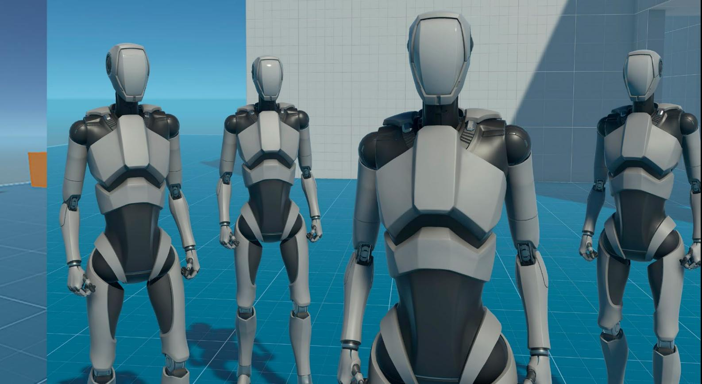


© 2024 Unity Technologies

# **Contents**

| Introduction 7                                       |
|------------------------------------------------------|
| The evolution of Unity tools for multiplayer games 8 |
| Basic concepts 10                                    |
| Headless servers 11                                  |
| UDP packets 12                                       |
| UDP versus TCP 13                                    |
| Ticks and updates 14                                 |
| Latency 15                                           |
| Other networking terms 16                            |
| Network synchronization 16                           |
| Techniques for network synchronization 17            |
| Network topologies 17                                |
| Client-server topology 18                            |
| Dedicated game server 18                             |
| Client-hosted listen server 19                       |
| Distributed authority 19                             |
| Local or couch multiplayer 20                        |
| Peer-to-peer (P2P) 20                                |
| What is an authoritative server? 20                  |
| Network stack 21                                     |
| Unity networking solutions 23                        |
| Netcode for GameObjects 23                           |
| Netcode for Entities 24                              |
| Unity Transport 25                                   |
| Third-party networking 26                            |

| Setting up your first Netcode project 27                |
|---------------------------------------------------------|
| Before you begin 27                                     |
| Sample project setup 28                                 |
| Installing Netcode for GameObjects 29                   |
| Adding the NetworkManager 30                            |
| NetworkObjects 31                                       |
| Player NetworkObjects 32                                |
| Creating a Player NetworkObject 33                      |
| Multiplayer Play Mode 36                                |
| Creating your own UI start buttons 41                   |
| Adding NetworkBehaviour 41                              |
| Authority and ownership properties44                    |
| Sync using a NetworkTransform<br>and NetworkAnimator 45 |
| Applying client authority 47                            |
| Owner authoritative mode components 49                  |
| Syncing with server authority 49                        |
| Singleton design pattern 53                             |
| Network synchronization 54                              |
| Gameplay mechanic 54                                    |
| Define a NetworkVariable 55                             |
| Adding an RPC 57                                        |
| Trigger mechanic 59                                     |
| RPCs versus NetworkVariables 59                         |
| Designing for multiplayer 60                            |
| Network latency and performance 61                      |
| Simulating latency 61                                   |

| Unity Transport Debug Simulator 61                        |  |
|-----------------------------------------------------------|--|
| Network Simulator 62                                      |  |
| Other network conditioners 63                             |  |
| Client-side interpolation 64                              |  |
| Client-side prediction and anticipation 65                |  |
| Why server authority 65                                   |  |
| How client-side prediction works 66                       |  |
| Reconciliation and rollback 67                            |  |
| Client-side anticipation in Netcode<br>for GameObjects 68 |  |
| Deterministic physics 70                                  |  |
| Client-side prediction in Netcode for Entities 70         |  |
| Testing and debugging networked games 73                  |  |
| Local testing 73                                          |  |
|                                                           |  |
| Player builds 73                                          |  |
| Multiplayer Play Mode (MPPM) 74                           |  |
| macOS users 74                                            |  |
| Simulating network conditions 74                          |  |
| Testing client connections 75                             |  |
| Clients connecting 75                                     |  |
| Clients disconnecting 75                                  |  |
| Host/Server starting the session 75                       |  |
| Host/Server shutting down 75                              |  |
| Techniques for debugging multiplayer games 76             |  |

| Multiplayer Services 78                                     |
|-------------------------------------------------------------|
| Matchmaker 79                                               |
| Lobby 80                                                    |
| Relay 80                                                    |
| Multiplay Hosting 81                                        |
| Vivox 81                                                    |
| Sample projects and resources 82                            |
| Resources for Netcode for GameObjects 82                    |
| Unity Learn: Get started with Netcode<br>for GameObjects 82 |
| Bitesize samples 84                                         |
| Boss Room 85                                                |
| Small Scale Competitive Multiplayer template 86             |
| VR Multiplayer template 88                                  |
| Resources for Netcode for Entities 89                       |
| Getting started with Netcode for Entities 89                |
| ECS Netcode samples 89                                      |
| ECS Network Racing 90                                       |
| Megacity Metro 90                                           |
| Experimental Multiplayer Services package 91                |
| Next steps 92                                               |

# <span id="page-5-0"></span>Introduction

When people get together in an online game, something extraordinary happens. That simple racing game or RPG transforms into a shared experience. What happens there can be unpredictable, challenging, and, most of all, fun.

Whether we are teaming up against an interstellar saboteur or dueling in an online shooter, networked multiplayer gaming allows us to collaborate and compete beyond physical boundaries. This collective interaction is what defines the multiplayer experience.

Developing networked gameplay, however, can be more complex than creating an equivalent single-player application.

The aim of this guide is to help you get started with developing multiplayer games using Unity's network tools. It provides a foundational knowledge of networking concepts and serves as a primer before you dive into the Unity network samples. It also walks you through a basic use case with the [Starter Assets – ThirdPerson](https://assetstore.unity.com/packages/essentials/starter-assets-thirdperson-updates-in-new-charactercontroller-pa-196526) package available on The Unity Asset Store.

This guide assumes you are familiar with Unity and C# development but may be new or just getting started with networking. It's designed to help you quickly understand the theoretical aspects of multiplayer development and prepare you for the practical demos.

This e-book will:

- Explore the core concepts of Unity multiplayer
- Explore different multiplayer systems and networking models
- Set up a simple example using Netcode for GameObjects

# <span id="page-6-0"></span>The evolution of Unity tools for multiplayer games

Unity provides a number of multiplayer development tools and solutions. These include the [Netcode for GameObjects](https://docs.unity3d.com/Packages/com.unity.netcode.gameobjects@2.1/manual/index.html) and [Netcode for Entities](https://docs.unity3d.com/Packages/com.unity.netcode@1.4/manual/index.html) frameworks, alongside [Unity Gaming](https://docs.unity.com/ugs/en-us/manual/overview/manual/unity-gaming-services-home)  [Services](https://docs.unity.com/ugs/en-us/manual/overview/manual/unity-gaming-services-home) (UGS), which features [Game Server Hosting \(Multiplay\)](https://docs.unity.com/ugs/en-us/manual/game-server-hosting/manual/welcome-to-multiplay) and [Vivox](https://docs.unity.com/ugs/en-us/manual/vivox-unity/manual/Unity/Unity) for voice and text chat. Whether you're building a casual co-op or an open-world MMO, Unity can help you hit the ground running with multiplayer development.

[Unity 6](https://unity.com/blog/unity-6-features-announcement) brings new and improved features for multiplayer games that make integration, iteration, and deployment more reliable and faster than ever. Here's a brief look at what's new in Unity 6 for multiplayer games:

- **[Multiplayer Center](https://docs.unity3d.com/6000.0/Documentation/Manual/multiplayer-center.html)**: Available as a core package in Unity 6, the Multiplayer Center makes it easier to set up and develop multiplayer games. New prompts and workflows use parameters and requirements for your game to suggest relevant packages and services before generating dynamic templates you can use to start your project.
- **[Multiplayer widgets](https://docs.unity3d.com/Packages/com.unity.multiplayer.widgets@1.0/manual/get-started-learn-widgets.html)**: Multiplayer widgets help you to integrate Unity Gaming Services (UGS) into your multiplayer game. You can access the widgets as a standalone package, or from the Multiplayer Center.
- **[Multiplayer Tools package](https://docs-multiplayer.unity3d.com/tools/current/install-tools/index.html)**: This package improves workflows for multiplayer game development in Unity, performance with Netcode for GameObjects 2.0, and adds support for Distributed Authority.
- **[Multiplayer Play Mode](https://docs-multiplayer.unity3d.com/mppm/current/about/index.html)**: This package streamlines your process for validating gameplay by launching up to four independent, lightweight editor processes from the same assets on disk. For the most ambitious server-hosted projects, Play Mode Scenarios allows you


to configure deployment steps, including the build of your dedicated server, and its upload straight to your Multiplay Hosting servers.

- **[Distributed Authority \(beta\)](https://docs.unity3d.com/Packages/com.unity.dedicated-server@1.3/manual/index.html)**: Distributed Authority, in beta as of November 2024, is available to use with Netcode for GameObjects. This package gives clients distributed ownership of authority over spawned NetcodeObjects during a game session. The netcode simulation workload is distributed across clients, while the network state is coordinated through a high-performance cloud backend which Unity provides.
- **[Multiplayer Services SDK](https://docs.unity.com/ugs/en-us/manual/mps-sdk/manual)**: This SDK is a one-stop solution for adding multiplayer elements to a game developed in Unity 6. The Unity Gaming Services (UGS) [Multiplayer](https://unity.com/solutions/build-backend#multiplayer) services like Relay, Matchmaker, and more, powers these capabilities to define how groups of players interact in your games through Sessions, which work with either the Netcode for GameObjects or the Netcode for Entities networking libraries.

Check out these resources to learn more about Unity 6 multiplayer solutions:

- [Unite 2024: Accelerating the creation of the your competitive multiplayer game](https://www.youtube.com/watch?v=-B8D9edqY1I)
- [Unite 2024: Going multiplayer: How to help your studio and game thrive](https://www.youtube.com/watch?v=UiAhrW8i7oA)
- [Unity Manual: New in Multiplayer in Unity 6](https://docs.unity3d.com/Manual/WhatsNewUnity6.html#multiplayer)
- [Unity 6 is here: See what's new](https://unity.com/blog/unity-6-features-announcement)

Unity's suite of tools supports the entire multiplayer game development lifecycle, from concept and prototyping to launch and ongoing operations. Work entirely within the Unity ecosystem or select the tools and services that best match the needs of your team.

# <span id="page-8-0"></span>Basic concepts

In multiplayer gaming, networking enables players to connect to a central server or directly to each other. This allows them to share data and play together in real-time. The same game application runs simultaneously on each player's device, and each player's actions are then synchronized across the network.

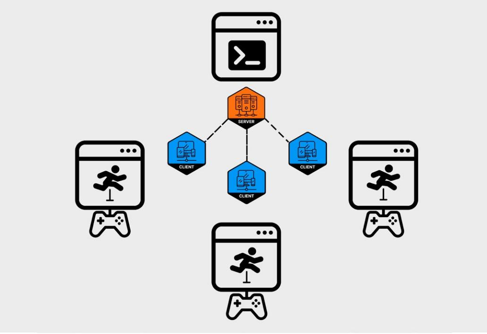

In networked multiplayer, the same game application runs across multiple devices.

<span id="page-9-0"></span>A typical networked game consists of two main components in its architecture, **clients** and **servers**. Clients are the instances of the game running on players' devices – PCs, consoles, or mobile phones. Clients render the game graphics, play the audio, handle user input, and send updates to the server about the player's actions.

Servers, on the other hand, manage the game state, the current status of all the elements in the game. They handle communication between clients and enforce the game's rules. Servers can be dedicated, [headless machines](#page-16-1) run by the game developers or they can be playerhosted, where one of the players also acts as the server.

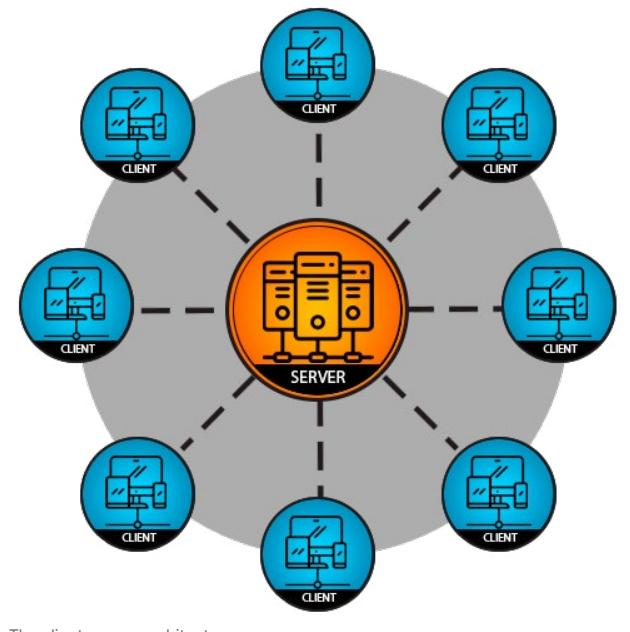

The server receives inputs from clients, processes game logic, and sends updates back to clients. Although the server is the final authority on the game state, clients maintain local copies for responsive gameplay. Constant synchronization then keeps the game as consistent as possible for all players in real-time.

The client-server architecture

#### **Headless servers**

A headless server is a server that operates without a graphical user interface, focusing solely on backend tasks.

Because they don't render graphics, they can scale more easily and are often deployed on dedicated hardware or cloud environments. For more information, see **Dedicated game server** under **Network Topologies**.

<span id="page-10-0"></span>

# UDP packets

Clients and servers communicate by exchanging data packets using standard Internet protocols like [UDP \(User Datagram Protocol\).](https://en.wikipedia.org/wiki/User_Datagram_Protocol) In real-time applications, especially fast-paced games like first-person shooters, UDP is preferred to TCP (Transmission Control Protocol) because it gives full control to the game to prioritize different aspects of the communication. Unlike TCP, UDP does not require acknowledgement from the recipient. This makes UDP a more efficient and flexible foundation but it also puts the burden on the application to handle cases when such functionality is required.

Each UDP packet consists of a **header** and a **payload**. The UTP payload contains additional protocol-specific sections, each with their own headers and payloads. In networking terminology, this nesting is known as **encapsulation**.

| [IP Header]<br>Source IP: 192.168.0.10<br>Destination IP: 192.168.0.20                                                                                                                |  |
|---------------------------------------------------------------------------------------------------------------------------------------------------------------------------------------|--|
| [UDP Header]<br>Source Port: 5000<br>Destination Port: 7777                                                                                                                           |  |
| [Netcode for GameObjects Header]                                                                                                                                                      |  |
| Protocol ID: 0×4E4654 (NGO)<br>Sequence Number: 1234<br>Remote ID: 5678<br>Type: Data                                                                                                 |  |
| [Payload]                                                                                                                                                                             |  |
| GameObject Updates:<br>- GameObject ID: 1001<br>- Transform:<br>- Position: (10.0, 20.0, 30.0)<br>- Rotation: (0.0, 45.0, 90.0)<br>- Player:<br>- Health: 80<br>- GameObject ID: 1002 |  |
|                                                                                                                                                                                       |  |

The IP and UDP headers are of a fixed size and contain important metadata like the address of the sender and receiver (IP address and ports). The payload varies in size, structure, and content, depending on the specific game and context. For example, a payload could carry player inputs or a snapshot of the game state at one moment in time.

Simplification of a UDP packet

UDP packets favor low latency and speed, essential for real-time applications; however, this speed comes with a lack of reliability as a tradeoff. The UDP protocol doesn't provide any mechanisms for reliability, ordering, or congestion control. A packet traveling through the internet could experience errors, including:

— **Packet Loss:** Sometimes a packet may get lost and never arrive at its destination. This could be due to network congestion, faulty hardware, or other issues.

<span id="page-11-0"></span>

- **Duplication:** A packet might be duplicated, resulting in the same packet arriving multiple times at the receiver. This can happen due to misconfigured network hardware or software.
- **Reordering:** Packets may arrive at the receiver in a different order than they were sent. This can happen if packets take different routes to the destination that have varying latencies.
- **Corruption:** Packet contents may get altered during transmission, resulting in unusable data.

#### **UDP versus TCP**

A **network protocol** is a set of rules and conventions that govern how data is transmitted and received over a network. Protocols define how to establish connections, format messages, handle errors, and transmit data.

UDP is typically preferred over [Transmission Control Protocol \(TCP\)](https://en.wikipedia.org/wiki/Transmission_Control_Protocol) in game development due to its fast and lightweight nature. TCP, while reliable and suitable for web browsing, ensures ordered data delivery by retransmitting lost or out-of-order packets; this can introduce lag or stutter that don't make it suitable for real-time gaming.

In contrast, UDP accepts some data loss to prioritize real-time performance. This means that games can run smoothly at 60 fps or higher without freezing, even if dropping some non-critical data. UDP usually strikes a better balance between responsiveness and occasional data loss, making it ideal for networked multiplayer games.

The following techniques can mitigate UDP's unreliability. Unlike the built-in functionality in TCP, they can be fine-tuned for use in real-time games.

| Technique                                  | What it does                                                                                                                                                                                                                                          |
|--------------------------------------------|-------------------------------------------------------------------------------------------------------------------------------------------------------------------------------------------------------------------------------------------------------|
| Sequence numbers                           | Each packet has a unique, increasing sequence<br>number. The receiver uses this to detect missing or<br>out-of-order packets.                                                                                                                         |
| Acknowledgement (ACK) and<br>ACK bitmasks  | Packets include the sequence number of the last<br>received packet, letting the sender know which<br>packets have been delivered. An ACK bitmask tracks<br>the status of multiple packets at once, allowing for<br>quicker detection of lost packets. |
| Retransmission timeout<br>adjustment (RTO) | This is a technique that makes use of measuring<br>round trip time in TCP approximation. For example,<br>you can measure the round trip time and then use<br>it to adjust client-side interpolation or client-side<br>prediction.                     |
| Timeouts                                   | If an acknowledgment isn't received within a certain<br>period, the packet is considered lost.                                                                                                                                                        |

<span id="page-12-0"></span>

# Ticks and updates

In a multiplayer game, the server handles the core game logic, physics simulations, and other gameplay functions, even if it doesn't have a display.

As the server is only handling the global game state, it takes its input from the clients, much like a single-player game handles inputs from a local player. Instead of having a mouse and keyboard, the server processes those inputs to maintain the "authoritative game state" – this includes everything from current player positions and object states to physics calculations and game progress.

The heart of server-side processing is the **server tick**. A server tick is a cycle during which the server updates the game state based on received inputs. This happens at a fixed interval known as the tick rate, measured in Hertz (Hz) or ticks per second. This tick rate determines the frequency at which the game world is updated.

Conversely, the **update rate** refers to how frequently the client exchanges data with the server. A higher update rate can enhance the responsiveness of the game but requires more bandwidth and processing power. It's typically constrained by the client's network capabilities and computing resources.

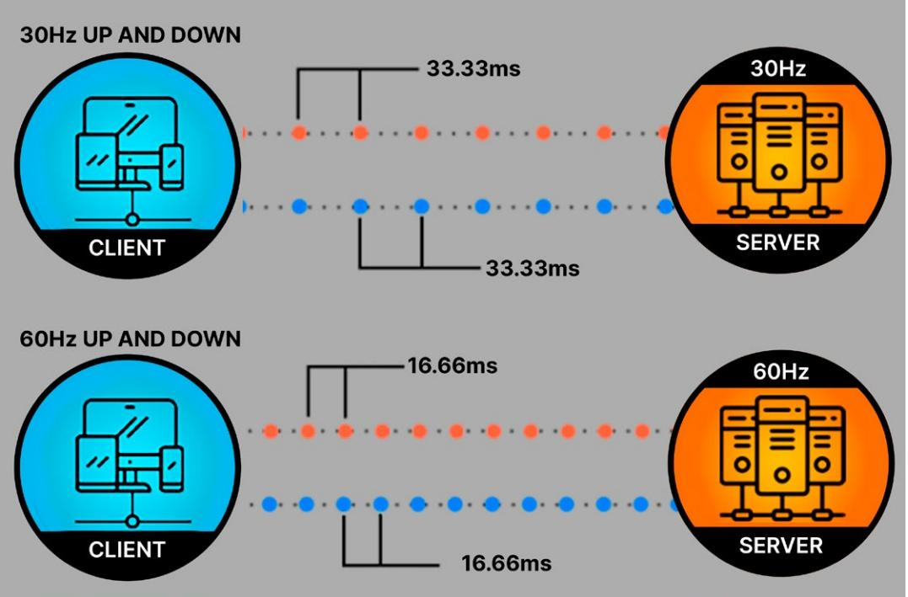

Tick rate versus update rate

A higher tick rate can improve the game's responsiveness but may strain server resources. Similarly, a higher update rate enhances interaction smoothness at the expense of greater data transmission. Creating a smooth and responsive multiplayer experience hinges on finding

<span id="page-13-0"></span>

the right balance between the tick rate and the update rate.

The actual tick rate can vary based on gameplay needs. A fast-paced first person shooter often runs at tick rates of 60 Hz or higher to reflect fast player movements and split-second shots. A real-time strategy game, on the other hand, doesn't rely on twitch reflexes, so a tick rate of 30 Hz may be sufficient. Meanwhile, a large-scale strategy MMO might use a fairly low tick rate of 10 Hz in order to support an extensive number of concurrent players.

## Latency

Latency is the time it takes for data to travel from the source to the destination. **Round-trip time (RTT)** measures how long it takes for a packet to travel to its destination and return with a response, providing a gauge of network latency.

While subjective, a general rule of thumb is that users notice gameplay degradation around 200ms of latency. Different types of games can tolerate more or less latency. For example, first-person shooter games perform best with less than 100ms of latency, whereas real-time strategy games might allow higher latency values of up to 500 ms.

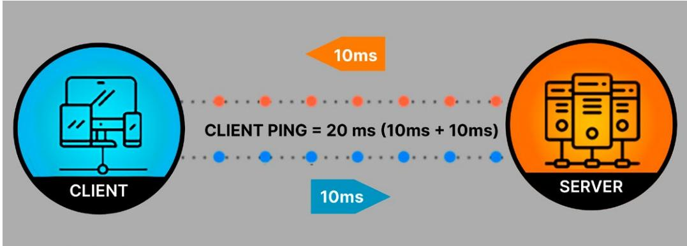

Round-trip time is a gauge of network latency.

Lower latency produces a responsive experience for the player. Ideally, there is minimal delay between a user's action and seeing the expected result in a multiplayer game. High latency leads to noticeable delays during gameplay.

Sometimes latency results from non-network components. For example, there may be a delay in detecting user input or a hiccup in the render pipeline. Another culprit is [Vsync:](https://docs.unity3d.com/6000.0/Documentation/ScriptReference/QualitySettings-vSyncCount.html) Though this feature can stop screen tearing, it does so at the cost of additional latency.

More often, the network itself is the major source of latency. It can involve several types of delays:

— **Processing delay:** Routers take time to read packet headers and forward packets to their destination. Though usually minimal, this delay can accumulate across multiple hops.

<span id="page-14-0"></span>

- **Transmission delay:** This is the time required to put packets onto the network, directly affected by packet size. This is more apparent on end-user networks with lower bandwidth.
- **Queueing delay:** When packets are held in queues due to congestion or limited interface capacity, this delay can significantly increase latency.
- **Propagation delay:** Signals take time to travel across the network. This type of delay results primarily from the physical distance between servers and users, the physical media (fiber, copper, air) and type of signal (electrical, optical, radio wave).

While some latency is unavoidable, especially in internet-based games, there are many techniques (e.g., [anticipation,](https://docs-multiplayer.unity3d.com/netcode/current/advanced-topics/client-anticipation/) [prediction](https://docs.unity3d.com/Packages/com.unity.netcode@1.2/manual/prediction.html), [interpolation\)](https://docs-multiplayer.unity3d.com/netcode/current/learn/clientside_interpolation/) to minimize its impact. We'll examine a few of these later.

#### **Other networking terms**

Here are some other terms that you may encounter when discussing latency:

**Ping:** This involves sending and receiving back a basic message to gauge network responsiveness. Think of it as a simplified version of Round Trip Time (RTT).

**Jitter:** This is the variation in RTT due to fluctuating network conditions, which can affect latency mitigation and cause packets to arrive out of order.

**Bandwidth:** This is the amount of data that can be transmitted over a network in a given amount of time. Higher bandwidth can be important for games that need to transmit large amounts of state data.

You can find these terms and more in this glossary page of [Multiplayer Networking](https://docs-multiplayer.unity3d.com/netcode/current/terms-concepts/mtt-terms/)  [Terminology](https://docs-multiplayer.unity3d.com/netcode/current/terms-concepts/mtt-terms/).

## Network synchronization

To stay in sync, clients and the server continuously exchange messages in order to maintain a consistent game state across all players. Typically, clients usually send user commands to the server at a high frequency – often at 60 Hz, or about every 16 milliseconds. These commands might be actions or inputs; for example, mouse or gamepad movements or button presses for jumping and shooting.

Once the server receives and processes the client commands, it then sends updates about the game world back to the clients. The faster the game reacts to player input, the more responsive it feels.

Just bear in mind that the server's tick rate, the client's update rate, and the client's frame rate serve different purposes and don't need to match. In fact, achieving perfect synchronization is uncommon. A server and its clients are constantly in flux, exchanging a continuous stream of dynamic data. The objective is to reduce their discrepancies, thereby creating the illusion that all clients are playing in unison.

<span id="page-15-0"></span>

### **Techniques for network synchronization**

**State synchronization** involves the periodic transmission of the state of network objects from the server to the clients. How frequently these game updates happen can vary based on the specific needs of the game genre (e.g. a competitive shooter versus a co-op strategy game).

**Remote procedure calls (RPCs)** invoke functions on the server or other clients remotely. Use RPCs for client-to-server communication, such as sending player inputs, requesting specific actions, or triggering one-time game events.

**Bandwidth management** can significantly impact performance. Synchronization consumes bandwidth, so implement strategies like the following to reduce data transmission over the network:

- **Data culling:** This reduces network traffic by excluding non-essential updates, focusing only on what is necessary for gameplay. For instance, you can sync only critical axes of movement or trigger VFX and animations locally using events instead of continuously synchronizing them. Any reduction in network traffic can enhance game performance.
- **Delta compression**: This also goes by the term [delta encoding.](https://en.wikipedia.org/wiki/Delta_encoding) It allows the server to send only the changes (deltas) since the last update. Clients then apply only these deltas to their local game state to keep it in sync with the server.
- **Interest management**: This prioritizes data synchronization based on several criteria. [Spatial relevance](https://docs-multiplayer.unity3d.com/netcode/current/terms-concepts/mtt-terms/#spatial-relevance) determines the priority of objects based on their distance from the player and their visibility. [Age \(or staleness\)](https://docs-multiplayer.unity3d.com/netcode/current/terms-concepts/mtt-terms/#age-staleness) prioritizes objects or data that haven't been transmitted recently, making them higher-priority until updated. [Interaction](https://docs-multiplayer.unity3d.com/netcode/current/terms-concepts/mtt-terms/#interaction) focuses on objects that have recently interacted with the player or are likely to do so soon.

These techniques can help you optimize network performance, ensuring a smoother and more efficient gameplay experience.

## Network topologies

Simply put, a network topology defines how devices are connected and communicate in a multiplayer environment. Each network model has its own advantages and disadvantages. Choosing one depends on the type of game, the desired level of control over the game state, and the resources available for server infrastructure.

Topologies can impact the game's architecture, performance, and the overall player experience. Netcode for GameObjects supports two primary topologies: [client-server](https://docs-multiplayer.unity3d.com/netcode/current/tutorials/get-started-ngo/) and [distributed authority](https://docs-multiplayer.unity3d.com/netcode/current/learn/distributed-authority-quick-start/). Let's unpack what that means.

<span id="page-16-0"></span>

#### **Client-server topology**

The client-server topology is a common network model that divides responsibilities between client devices and a central server to optimize performance and manage the game effectively.

A **client** represents a player's game instance, handling local inputs, rendering, and partial simulation of the game state. Clients send local inputs like character movements to the server and receive updates in return.

The **server** maintains the definitive, accurate representation of the game world, processing player inputs and enforcing game rules. This central server resolves conflicts and validates actions, ensuring a consistent and fair experience for all players. This setup also helps prevent cheating by controlling game state centrally.

Clients and servers can communicate with each other over the internet or a local area network (LAN). Offline LAN games connect multiple devices within the same physical vicinity through a local network without needing internet access. This setup bypasses the internet and ensures minimal latency, high security, and reliable connectivity due to the close proximity of the devices. This makes it suitable for LAN parties, esports tournaments, and environments where the internet is unstable.

There are two types of servers within the client-server topology:

#### <span id="page-16-1"></span>Dedicated game server

A **dedicated game server** is a separate entity that only processes data and doesn't participate as a player. It can offer the highest performance while handling all major simulations and player interactions in networked games.


Dedicated servers are integral for games where minimizing cheating is paramount. However, this setup can introduce communication latency as all player state changes need to be processed by the server before being relayed to other clients.

Dedicated servers are particularly well-suited for performance-sensitive, competitive games such as first-person shooters. They can be essential to maintaining fairness and reducing disruptive behavior.

A dedicated game server handles all major game simulations.

<span id="page-17-0"></span>

### Client-hosted listen server

A **client-hosted listen server** acts as both server and client, allowing the host to play the game. This can help reduce costs but gives the host a latency advantage (since no packets need to be sent across the network).

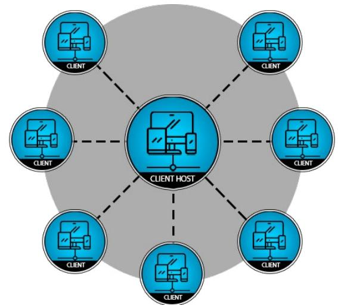

This setup often results in degraded server performance since the same machine is tasked with running the game server and generating the visual output for the host player. Also, because the hosting client services connections via a residential internet connection, it can be slower than using a dedicated server in a remote data center. This is because residential internet service providers typically prioritize download performance over upload performance.

A client-hosted listen server acts as both a server and client.

#### **Distributed authority**

The **distributed authority** network model decentralizes control and management of game state among all participating clients. Each client is responsible for owning, tracking, and managing a portion of the state of objects within the game, with the ability to spawn and manage these objects autonomously.

A central, lightweight service monitors changes in object states and manages the routing of network traffic, but it does not simulate the game itself.

This topology offers several benefits, including reduced costs and lower input latency, as it eliminates the need for a central server to process all game actions and reduces network round-trips since each client is authoritative over its own objects. For example, that means it can handle actions like movement, attacks, or other game inputs locally without waiting for permission from a server. This results in more immediate feedback for the player, which in turn makes the game feel more responsive. However, it also can be subject to increased vulnerability to cheating as there's no single authoritative server to validate all actions.

Distributed authority is less suitable for games requiring precise simulations or high competitiveness but works well for games with less critical interaction needs.

<span id="page-18-0"></span>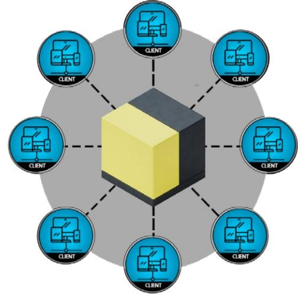

You can learn more about Unity's new Distributed Authority package (beta) for Netcode for GameObjects in [this Unite 2024](https://www.youtube.com/watch?v=3jBOTk_qozA)  [session](https://www.youtube.com/watch?v=3jBOTk_qozA).

The distributed authority model decentralizes control and game management.

### **Local or couch multiplayer**

Local multiplayer games use a single client runtime instance that can be played by two or more people on the same screen in the same physical location. This setup is ideal for social gaming scenarios, offering direct interaction among players without any need for networking. It's popular in party games and co-op modes, providing a straightforward way for friends and family to play together.

### **Peer-to-peer (P2P)**

Each device functions as both client and server, allowing for direct connections between players. This resembles distributed authority but disposes of the lightweight server altogether. This method helps reduce the need for centralized servers, lowering costs and complexity. However, it can introduce challenges in ensuring fairness and consistent latency, as there is no central authority to manage game state and security.

#### **What is an authoritative server?**

An authoritative server refers to a server setup that is the central controller of game states and logic. As the name implies, it's the final authority in a networked game.

Rather than splitting authority of what is happening in the game across the player machines, an authoritative server runs the full game simulation itself and dictates what is happening in the game. Clients simply send their inputs to the server, which then updates the game and sends back the latest game state.

The server also enforces game rules and resolves conflicts. Authoritative servers are one of the simplest ways to implement networked game logic and the one least prone to exploitation by cheaters, ensuring a uniform experience for everyone playing the game.

# <span id="page-19-0"></span>Network stack

A [protocol stack,](https://en.wikipedia.org/wiki/Protocol_stack) or network stack, is generally speaking software that implements various communication protocols to enable data transmission across networks. It's organized like a layered cake:

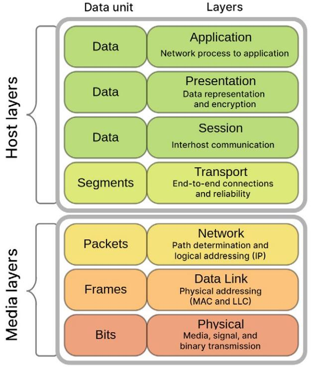

The Network stack (source: [Wikipedia](https://en.wikipedia.org/wiki/Protocol_stack))

Each layer only interacts with the layers directly above and below it, providing modularity and simplifying network management.

**Application layer:** The high-level of the stack where most Unity development takes place. Packages like Netcode for GameObjects or Netcode for Entities abstract away the complexities of lower-level networking, allowing developers to focus on implementing multiplayer functionality.

**Transport layer:** The transport layer is responsible for providing reliable data transfer, error detection and correction, flow control, and ensuring end-to-end communication between devices in a network. It facilitates the segmentation and reassembly of data packets and provides mechanisms for error recovery and data integrity.

**Network layer:** The network layer is responsible for routing data packets between networked devices across different networks. It relies on the network infrastructure and protocols, such as IP (Internet Protocol), to handle communication.


**Data link and physical layers:** These layers directly handle physical transmission of data packets over the network medium, such as Ethernet or Wi-Fi. The data link layer and physical layers are typically handled by the operating system and network hardware.

As a Unity developer, you'll primarily work with the high-level application layer to implement multiplayer features, such as synchronizing GameObjects, managing game state, and handling player interactions.

Generally, you won't need to worry about the lower layers unless your application has specific requirements. This simplifies the network stack to something that looks like this:


Netcode development layers

# <span id="page-21-0"></span>Unity networking solutions

Unity provides comprehensive solutions for developing multiplayer games across various genres and scales. Selecting the right netcode solution is crucial because different game types have specific networking demands.

Consider several factors here, including the game genre, scale, level of competitiveness, and the desired control over the networking layer. Casual games often prioritize simplicity and cost-effectiveness, while competitive games require precise and robust network management to ensure fairness and responsiveness.

Whether you are building a casual cooperative game or a competitive action title, Unity offers powerful netcode packages and complementary services to meet your needs.

# Netcode for GameObjects

For casual cooperative multiplayer games, Unity recommends using the [Netcode for](https://docs.unity3d.com/Packages/com.unity.netcode.gameobjects@2.1/manual/index.html)  [GameObjects](https://docs.unity3d.com/Packages/com.unity.netcode.gameobjects@2.1/manual/index.html) (NGO) package. This high-level solution simplifies developing multiplayer games by abstracting networking logic, making it easier to manage the game state for all players.

If you're just getting started with multiplayer development, NGO serves as an excellent starting point.

Netcode for GameObjects includes a few key features:

— **NetworkObject:** This represents any object in the game that should be synchronized over the network. It handles object spawning, despawning, and ownership.

<span id="page-22-0"></span>

- **NetworkBehaviour:** This is a specialized MonoBehaviour that provides networking capabilities. It offers built-in callbacks for handling network events and allows you to write server-side and client-side code.
- **Remote procedure calls (RPCs)**: These send messages and invoke methods on remote instances of your GameObjects using Server and Client RPCs.
- **NetworkVariable:** This [is a class](https://docs-multiplayer.unity3d.com/netcode/current/basics/networkvariable/index.html#docusaurus_skipToContent_fallback) that allows you to sync states across the network.
- **NetworkManager:** This is [a central component](https://docs-multiplayer.unity3d.com/netcode/current/components/networkmanager/) that manages the network state of your game, handling tasks such as connection, disconnection, and scene management.

These components work at the application layer to help you implement multiplayer functionality. Netcode for GameObjects is designed to be simple yet powerful, providing the tools needed to create robust and scalable multiplayer games.

## Netcode for Entities

Built on top of Unity's [Data-Oriented Technology Stack \(DOTS\)](https://blog.unity.com/engine-platform/new-ebook-understanding-unity-dots) and the Entity Component System (ECS), [Netcode for Entities](https://docs.unity3d.com/Packages/com.unity.netcode@1.4/manual/index.html) is designed for server-authoritative gameplay. It includes advanced features like client-side prediction, interpolation, and lag compensation.

In this setup, a centralized server handles all game simulations, reducing cheating by controlling game outcomes. Clients send inputs to the server, which processes these inputs and sends back the updated game state, minimizing potential manipulation.

Netcode for Entities includes client-side prediction to mitigate latency, creating a smoother, near zero-lag experience. Compared to Netcode for GameObjects, it offers better scalability and bandwidth optimization.

If you're an experienced multiplayer developer with a project that requires a high degree of performance and determinism, DOTS and ECS might be the right base for your game.

To learn more about data-oriented design in Unity read our [DOTS e-book](https://blog.unity.com/engine-platform/new-ebook-understanding-unity-dots) and reference this DOTS [resources list](https://blog.unity.com/engine-platform/dots-bootcamp-resources).


The Unity sample ECS Network Racing is built with Netcode for Entities.

<span id="page-23-0"></span>

Choosing the right Netcode solution depends on your project's requirements and your team's expertise. You can start by using the table below to help inform your decision.

| Feature                       | Netcode for GameObjects                                                                                                               | Netcode for Entities                                                                                                    |
|-------------------------------|---------------------------------------------------------------------------------------------------------------------------------------|-------------------------------------------------------------------------------------------------------------------------|
| Target audience               | Beginners and intermediate developers                                                                                                 | Advanced developers                                                                                                     |
| Architecture                  | Object-oriented (MonoBehaviour-based)                                                                                                 | Data-oriented (Entity<br>Component System -<br>ECS and DOTS)                                                            |
| Performance                   | Suitable for smaller scale games                                                                                                      | Optimized for high<br>performance and<br>scalability                                                                    |
| Scalability                   | Limited, ideal for a small number of players                                                                                          | High, designed for<br>large-scale games                                                                                 |
| Networking<br>features        | NetworkVariables, RPCs, NetworkTransform,<br>limited client-side prediction (anticipation),<br>interpolation, supports UnityTransport | Full featured client<br>side prediction,<br>interpolation, lag<br>compensation,<br>supports optimized<br>UnityTransport |
| Unity Services<br>Integration | Full support for Lobby, Relay, etc.                                                                                                   | Full support for Lobby,<br>Relay, etc.                                                                                  |
| Sample projects               | Boss Room, Bite Size Samples                                                                                                          | Megacity Metro, ECS<br>Racing, Netcode<br>Samples                                                                       |

Another great resource is Unity [Multiplayer Center.](https://docs.unity3d.com/6000.0/Documentation/Manual/multiplayer-center.html) The Multiplayer Center provides a starting point to create a multiplayer game. It recommends Unity multiplayer packages based on the needs of your game, and gives you access to samples and tutorials to help you use them. See the [Multiplayer Center documentation](https://docs.unity3d.com/6000.0/Documentation/Manual/multiplayer-center.html) for instructions on how to get and set up the package in your project.

# Unity Transport

The [Unity Transport Package](https://docs.unity3d.com/Packages/com.unity.transport@2.0/manual/index.html) is a netcode-agnostic library that provides a low-level network layer focused on performance and reliability – a modern, secure, and portable transport library that extends the conventional UDP with advanced features:

- **Reliability:** Adds reliable communication over UDP, ensuring critical messages are delivered without the overhead of TCP
- **Security:** Incorporates encryption and authentication to protect data from unauthorized access

<span id="page-24-0"></span>

- **Performance:** Optimized for low latency and high throughput
- **Cross-platform compatibility:** Designed to work seamlessly across different platforms and devices

Both Netcode for GameObjects and Netcode for Entities rely by default on Unity Transport. Developers looking to keep fine-grain control over the network can also use Unity Transport as a standalone library and build their own customized netcode on top for specific game needs.

Unity Transport now adds WebGL support that can enhance the cross-platform and web multiplayer experience.

#### **Third-party networking**

Though we recommend starting with Netcode for GameObjects, it's important to understand it's not your only option. The Unity community features many different solutions to fit your specific needs.

Here are some third-party networking options available from the Unity Asset Store:

- **[Photon Unity Networking \(PUN\)](https://assetstore.unity.com/packages/tools/network/photon-unity-networking-classic-free-1786):** Photon offers a comprehensive and scalable solution suitable for games demanding high concurrent user numbers.
- **[Mirror:](https://assetstore.unity.com/packages/tools/network/mirror-129321)** Known for its simplicity and ease of use, Mirror is a free open-source networking library originally based on Unity's UNet.
- **[DarkRift Networking 2](https://assetstore.unity.com/packages/tools/network/darkrift-networking-2-95309):** This solution provides both high performance and flexibility and is tailored for developers looking for detailed control over their networking.
- **[Forge Networking Remastered](https://assetstore.unity.com/packages/tools/network/forge-networking-remastered-38344)**: This is an open-source option that allows for advanced customization and control.

# <span id="page-25-0"></span>Setting up your first Netcode project

If you haven't already tried Unity's networking solutions, setting up a basic Netcode project involves importing the necessary networking packages and then configuring the necessary multiplayer components.

This chapter will walk through your first steps to add networking to a sample project using Netcode for GameObjects. Remember that in Unity 6 you can use [Multiplayer Center](https://docs.unity3d.com/6000.0/Documentation/Manual/multiplayer-center.html) to set up a new multiplayer project, and [Multiplayer Widgets](https://docs.unity3d.com/Packages/com.unity.multiplayer.widgets@1.0/manual/get-started-learn-widgets.html) for integrating additional Unity services into the project.

# Before you begin

Make sure you have the following:

- An active Unity account with a valid license
- The [Unity Hub](https://unity.com/download)
- A supported version of the Unity Editor; some features demonstrated here require Unity 6 or higher, refer to the [Netcode for GameObjects requirements](https://docs-multiplayer.unity3d.com/netcode/current/installation)
- A connection to the Unity Cloud dashboard to connect to the Unity services your project will need; you can do this via the Unity Hub

<span id="page-26-0"></span>

# Sample project setup

It's helpful to demo these netcode tools on an existing project with single-player locomotion. In this guide, we'll use the [Starter Assets – ThirdPerson package](https://assetstore.unity.com/packages/essentials/starter-assets-thirdperson-updates-in-new-charactercontroller-pa-196526) from the Unity Asset Store. This simulates simple 3D gameplay with a humanoid character using the Universal Render Pipeline (URP).

Get this free asset from the Unity Asset Store and then import it using the Package Manager.


The Starter Assets package from the Asset Store

This demo project includes a small testing playground scene and a configurable third-person controller. The goal is to run multiple copies of this application and then have different clients interact in the same environment.

# <span id="page-27-0"></span>Installing Netcode for GameObjects

In the Package Manager (**Window > Package Manager**), filter for the Unity Registry. Then install the following packages:

- **Netcode for GameObjects**: This is a foundational networking library that adds multiplayer capabilities to the existing GameObject/MonoBehaviour workflow. It streamlines multiplayer game development and is a great starting point for working with networked multiplayer.
- **Multiplayer Tools Window:** This is an extra suite of five new tools introduced in Unity 6 that improve workflows for multiplayer development:
	- The [Multiplayer Tools Window](https://docs-multiplayer.unity3d.com/tools/current/multiplayer-tools-window/) provides convenient access to all of the multiplayer tools and their documentation in one place.
	- The [Network Simulator](https://docs-multiplayer.unity3d.com/tools/current/tools-network-simulator/) replicates real-world network conditions, such as packet delay, loss, and disconnections to identify potential issues before going live.
	- The [Runtime Network Stats Monitor \(RNSM\)](https://docs-multiplayer.unity3d.com/tools/current/RNSM/) displays real-time network statistics, providing configurable onscreen monitoring of network performance.
	- [Network Scene Visualization](https://docs-multiplayer.unity3d.com/tools/current/netscenevis/) enhances debugging by visually displaying network activity and object ownership in the scene view.
	- The [Hierarchy Network Debug view](https://docs-multiplayer.unity3d.com/tools/current/hierarchy-network-debug/) provides an overlay on the right-hand side of your Hierarchy window that identifies which objects are networked (with a small network cube logo).
- [Multiplayer Play Mode:](https://docs-multiplayer.unity3d.com/mppm/current/about/) This Unity 6 package enables you to test multiplayer functionality without leaving the Unity Editor. You can simulate up to four players (the Main Editor Player plus three Virtual Players) for faster playtesting.

|                        |           |                             |                  | Package Manager  |         |
|------------------------|-----------|-----------------------------|------------------|------------------|---------|
| Package Manager        |           |                             |                  |                  | :       |
| + ▼ Sort: Name (asc) ▼ | Filters ▼ | Clear Filters               |                  |                  | :       |
| In Project             |           | Search Unity Registry<br>of |                  | 3 items selected |         |
| Updates                |           | Multiplay                   | 1.1.1            | Install 1 item   | Install |
| Unity Registry         |           | Multiplayer Play Mode       | 1.0.0            | > Remove 2 items | Remove  |
| റ്റ<br>My Assets       |           | Multiplayer Tools           | 2.1.0 V          |                  |         |
| 글<br>Built-in          |           | Netcode for Entities        | 1.2.0            |                  |         |
|                        |           | Netcode for GameObjects     | 1.8.1 V          |                  |         |
| Services               |           | Oculus XR Plugin            | 4.2.0            |                  |         |
|                        |           | OpenXR Plugin               | 1.10.0           |                  |         |
|                        |           | @ Performance testing API   | 3.0.3 V          |                  |         |
|                        |           | Polybrush                   | 1.1.6            |                  |         |
|                        |           | Post Processing             | 3.4.0            |                  |         |
|                        |           | ProBuilder                  | 6.0.1            |                  |         |
|                        |           | Profile Analyzer            | 1.2.2            |                  |         |
|                        |           | Push Notifications          | 4.0.0-pre.1   RC |                  |         |
|                        |           | Python Scripting            | 7.0.1            |                  |         |
|                        |           | Recorder                    | 5.1.0            |                  |         |
|                        |           | Last update Apr 23, 14:12   | C                |                  |         |

Install Netcode for GameObjects and its supporting packages.

<span id="page-28-0"></span>

# Adding the NetworkManager

Every project will need a **NetworkManager** component to support networked multiplayer. This essential component manages the network state of your project, handling connections and network configurations.

To add a NetworkManager to your scene, create a new GameObject in the Hierarchy and add the **NetworkManager** component (**Netcode > NetworkManager**).

In the NetworkManager component, configure the **Network Transport** layer. Choose Unity Transport.

| ▼ > Network Manager                   |                                                                                                     | 2 |   |
|---------------------------------------|-----------------------------------------------------------------------------------------------------|---|---|
| Run In Background                     | >                                                                                                   |   |   |
| Log Level                             | Normal                                                                                              |   | V |
| Player Prefab                         | None (Game Object)                                                                                  |   | O |
| V Network Prefabs Lists               |                                                                                                     | 1 |   |
| Element O                             | @ DefaultNetworkPrefabs (Network Prefabs List)                                                      |   | O |
|                                       |                                                                                                     | + |   |
| General                               |                                                                                                     |   |   |
| Protocol Version                      | 0                                                                                                   |   |   |
| Network Transport                     | Missing (Network Transport)                                                                         |   | 0 |
|                                       | You have no transport selected. A transport is required for netcode to work. Which one do you want? |   |   |
|                                       |                                                                                                     |   |   |
| V Select transport                    |                                                                                                     |   |   |
| UnityTransport                        |                                                                                                     |   |   |
| Ensure Network Variable Length Safety |                                                                                                     |   |   |
| Connection                            |                                                                                                     |   |   |
| Connection Approval                   |                                                                                                     |   |   |
| Client Connection Buffer Timeout      | 10                                                                                                  |   |   |
| Spawning                              |                                                                                                     |   |   |
| Force Same Prefabs                    | >                                                                                                   |   |   |
| Recycle Network Ids                   | >                                                                                                   |   |   |
| Network Id Recycle Delay              | 120                                                                                                 |   |   |
| Bandwidth                             |                                                                                                     |   |   |
| Rpc Hash Size                         | Var Int Four Bytes                                                                                  |   |   |
| Scene Management                      |                                                                                                     |   |   |
| Enable Scene Management               | >                                                                                                   |   |   |
| Load Scene Time Out                   | 120                                                                                                 |   |   |
| Start Connection                      |                                                                                                     |   |   |
|                                       | Start Host                                                                                          |   |   |
|                                       | Start Server                                                                                        |   |   |
|                                       | Start Client                                                                                        |   |   |

Select a transport layer in the NetworkManager.

This attaches a **UnityTransport** component to the GameObject. The transport layer is responsible for low-level networking tasks, such as connection management, data transmission, and packet encryption.

| J √ Unity Transport         |                                                                                                         |  |  |
|-----------------------------|---------------------------------------------------------------------------------------------------------|--|--|
| Protocol Type               | Unity Transport                                                                                         |  |  |
| Max Packet Queue Size       | 128                                                                                                     |  |  |
| Max Payload Size            | 6144                                                                                                    |  |  |
| Heartbeat Timeout MS        | 500                                                                                                     |  |  |
| Connect Timeout MS          | 1000                                                                                                    |  |  |
| Max Connect Attempts        | 60                                                                                                      |  |  |
| Disconnect Timeout MS       | 30000                                                                                                   |  |  |
| Debug Simulator             |                                                                                                         |  |  |
| Address                     | 127.0.0.1                                                                                               |  |  |
| Port                        | 7777                                                                                                    |  |  |
| device.                     | It's recommended to leave remote connections disabled for local testing to avoid exposing ports on your |  |  |
| Allow Remote Connections?   |                                                                                                         |  |  |
| Override Bind IP (optional) |                                                                                                         |  |  |

The UnityTransport component

<span id="page-29-0"></span>Though you don't need to modify these settings yet, this component can help simulate network conditions (e.g., latency, packet loss, and jitter) for testing and debugging in the Editor.

Save the scene and go to **File > Build Settings** and make sure your current scene is added to the **Scenes in Build** list. This ensures the new NetworkManager is included in the game build.

# NetworkObjects

[NetworkObject](https://docs-multiplayer.unity3d.com/netcode/current/basics/networkobject/) is a required component for any GameObject that needs to be networked or synchronized across different clients in a multiplayer game. When you add a NetworkObject component to a GameObject, it becomes "networkable," meaning that its state and behavior can be shared and updated across the network.

| ▼ # √ Network Object            |           | 3 - |  |
|---------------------------------|-----------|-----|--|
| Always Replicate As Root        |           |     |  |
| Synchronize Transform           | >         |     |  |
| Active Scene Synchronization    |           |     |  |
| Scene Migration Synchronization | >         |     |  |
| Spawn With Observers            | >         |     |  |
| Dont Destroy With Owner         |           |     |  |
| Auto Object Parent Sync         | >         |     |  |
| GlobalObjectIdHash              | 208923481 |     |  |
| NetworkManager                  | null      |     |  |

The NetworkObject component and its unique ID

Each NetworkObject has a few identifiers:

- The **GlobalObjectIdHash** identifies the prefab asset in the project.
- The **NetworkObjectId** is the unique identifier that differentiates instances of the same prefab asset.
- The **OwnerClientId** represents the client that "owns" the object (see Authority below).

These identifiers help the NetworkManager keep track of it and ensure that its state is consistent across all connected clients. NetworkObjects can be dynamically created (spawned) or destroyed during gameplay.

Spawning a NetworkObject makes it appear on all connected clients. Each NetworkObject has an owner, typically the client that controls its behavior and state.

<span id="page-30-0"></span>

# Player NetworkObjects

Each player can optionally have their own prefab called a [Player NetworkObject.](https://docs-multiplayer.unity3d.com/netcode/current/basics/networkobject/#player-networkobjects) This is a special type of NetworkObject that often contains the character controller and visual representation of the player in the game.

| 0<br>Preview             | V<br>PlayerArmature_Networked     |                                      |                                                                                                                                                                               |       |                                       |        | Static · |         |
|--------------------------|-----------------------------------|--------------------------------------|-------------------------------------------------------------------------------------------------------------------------------------------------------------------------------|-------|---------------------------------------|--------|----------|---------|
| <br>Preview              | Tag Player                        |                                      |                                                                                                                                                                               | Layer |                                       |        |          |         |
| PlayerArmature_Networked |                                   |                                      |                                                                                                                                                                               |       |                                       |        |          |         |
|                          | V 25<br>Transform                 |                                      |                                                                                                                                                                               |       |                                       |        | @ 花      |         |
|                          | Position                          |                                      | ×<br>0                                                                                                                                                                        |       | Y O                                   | Z<br>0 |          |         |
|                          | Rotation                          |                                      | ×<br>0                                                                                                                                                                        |       | Y O                                   | Z<br>0 |          |         |
|                          | Scale                             |                                      | QX 1                                                                                                                                                                          |       | Y21                                   | Z 1    |          |         |
|                          | 0                                 | ✓ Character Controller               |                                                                                                                                                                               |       |                                       |        |          | 0 花     |
|                          |                                   | > > Third Person Controller (Script) |                                                                                                                                                                               |       |                                       |        | @        | 北       |
|                          | > Animator                        |                                      |                                                                                                                                                                               |       |                                       |        | @        | 25<br>1 |
|                          | Starter Assets Inputs (Script)    |                                      |                                                                                                                                                                               |       |                                       |        | @        | 北       |
|                          | V Player Input<br>(1)             |                                      |                                                                                                                                                                               |       |                                       |        | @        | 14<br>  |
|                          | V Network Object                  |                                      |                                                                                                                                                                               |       |                                       |        | @        | 本       |
|                          | Always Replicate As Root          |                                      | ﺍﻟﻤﻮﺍﻗﻊ ﺍﻟﻤﺴﺘﻮﻯ ﺍﻟﻤﺴﺘﻮﻯ ﺍﻟﻤﺴﺘﻮﻯ ﺍﻟﻤﺴﺘﻮﻯ ﺍﻟﻤﺴﺘﻮﻯ ﺍﻟﻤﺴﺘﻮﻯ ﺍﻟﻤﺴﺘﻮﻯ ﺍﻟﻤﺴﺘﻮﻯ ﺍﻟﻤﺴﺘﻮﻯ ﺍﻟﻤﺴﺘﻮﻯ ﺍﻟﻤﺴﺘﻮﻯ ﺍﻟﻤﺴﺘﻮﻯ ﺍﻟﻤﺴﺘﻮﻯ ﺍﻟﻤﺴﺘﻮﻯ ﺍﻟﻤﺴﺘﻮﻯ ﺍﻟﻤﺴﺘﻮﻯ ﺍﻟﻤﺴﺘﻮﻯ ﺍﻟﻤﺴﺘﻮﻯ ﺍﻟﻤﺴﺘﻮﻯ ﺍﻟﻤﺴﺘﻮﻯ ﺍﻟﻤﺴﺘ |       |                                       |        |          |         |
|                          | Synchronize Transform             |                                      | >                                                                                                                                                                             |       |                                       |        |          |         |
|                          | Active Scene Synchronization      |                                      |                                                                                                                                                                               |       |                                       |        |          |         |
|                          | Scene Migration Synchronization   |                                      | >                                                                                                                                                                             |       |                                       |        |          |         |
|                          | Spawn With Observers              |                                      | >                                                                                                                                                                             |       |                                       |        |          |         |
|                          | Dont Destroy With Owner           |                                      |                                                                                                                                                                               |       |                                       |        |          |         |
|                          | ><br>Auto Object Parent Sync      |                                      |                                                                                                                                                                               |       |                                       |        |          |         |
|                          | GlobalObjectIdHash<br>3715449585  |                                      |                                                                                                                                                                               |       |                                       |        |          |         |
|                          | NetworkManager                    |                                      | null                                                                                                                                                                          |       |                                       |        |          |         |
|                          | Client Player Move (Script)       |                                      |                                                                                                                                                                               |       |                                       |        | @ 花      |         |
|                          | Client Network Transform (Script) |                                      |                                                                                                                                                                               |       |                                       |        | @        | 北<br>2  |
|                          | Client Network Animator (Script)  |                                      |                                                                                                                                                                               |       |                                       |        | @        | 北<br>10 |
|                          | Animator                          |                                      |                                                                                                                                                                               |       | > PlayerArmature_Networked (Animator) |        |          | 0       |

The Player NetworkObject in the sample project

Player NetworkObjects often store and sync player-specific data, such as the player's name, score, inventory, or other relevant information. This data is synchronized across the network to ensure that all connected players have a consistent view of the game state.

When a client connects, the NetworkManager creates a Player NetworkObject that is "owned" by the corresponding player. This means that the player has authority over their PlayerObject and can control its behavior and state.

To set up a Player NetworkObject, start by creating a standard prefab GameObject in your project. This prefab acts as a template for the PlayerObject, containing the necessary components and scripts that define the player's behavior and appearance.

<span id="page-31-0"></span>

Then, add the appropriate netcode components. These might include:

- **NetworkObject:** Every object that will be networkable needs a NetworkObject component. This contains properties and events related to spawning, despawning, and ownership.
- **NetworkBehaviours:** These scripts add networking behavior to their MonoBehaviour base class. NetworkBehaviours contain network variables, remote procedure calls (RPCs), and network callbacks.
- **NetworkAnimators:** This component syncs animation states and parameters between clients.
- **NetworkTransform:** This component ensures that the player's position, rotation, and scale are replicated in real-time from the server to all connected clients.

Player NetworkObjects are often responsible for handling player input. When a player performs an action, such as moving or interacting with the game world, the input is processed and then propagated to other connected players as needed.

Player logic involves a combination of MonoBehaviours for direct game mechanics and NetworkBehaviours for managing network states. Non-networked components, such as character controllers and animators, function normally on each player's local instance.

Using these components locally not only optimizes performance but also reduces network traffic, which can be important when working with limited bandwidth between your clients.

## Creating a Player NetworkObject

Load up the **Playground** scene from the sample project.


The Starter Assets bundle includes a Playground scene.


The Hierarchy includes a PlayerArmature that drives the game character. To convert this into a Player NetworkObject, drag it from the Hierarchy to create a new Original Prefab or modify a copy of the existing prefab in the project.

In the Hierarchy window, locate the PlayerArmature GameObject. Delete it to remove the PlayerArmature and its child objects from the scene, leaving only the game environment in the scene.

Then, edit the prefab in the Inspector. Add the **NetworkObject** component. This component is required for the object to be recognized and managed across the network.

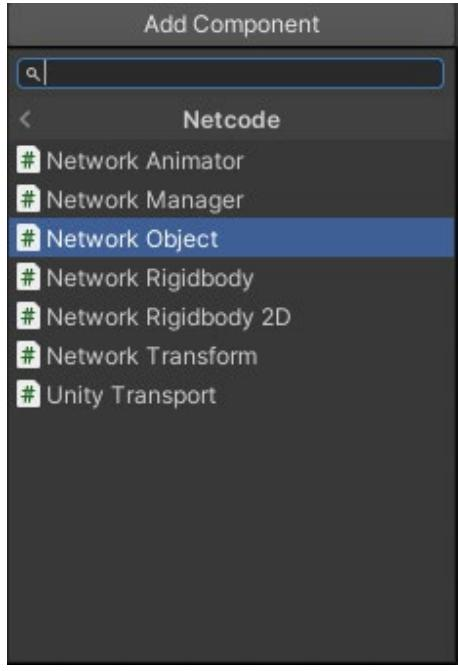

Add the NetworkObject to the prefab.

Register the Player NetworkObject in the **Player Prefab** field of the NetworkManager.

| V Network Manager       |                                  | 0 | 14 |   |
|-------------------------|----------------------------------|---|----|---|
| Run In Background       | V                                |   |    |   |
| Log Level               | Normal                           |   |    |   |
| Player Prefab           | PlayerArmature_Networked         |   |    |   |
| > Network Prefabs Lists |                                  |   |    |   |
| General                 |                                  |   |    |   |
| Protocol Version        | 0                                |   |    |   |
| Network Transport       | NetworkManager (Unity Transport) |   |    | 0 |
| Tick Rate               | 30                               |   |    |   |
| Performance             |                                  |   |    |   |

Register the Player NetworkObject in the NetworkManager.


Play mode only shows the game environment. The Player NetworkObject will only appear when a client connects.

Select the **NetworkManager**, which now appears under **DontDestroyOnLoad** in the Hierarchy.

| V Network Manager                 |                                  | 0 | 14 |   |
|-----------------------------------|----------------------------------|---|----|---|
| Run In Background                 | >                                |   |    |   |
| Log Level                         | Normal                           |   |    | A |
| Player Prefab                     | PlayerArmature_Networked         |   |    | 0 |
| > Network Prefabs Lists           |                                  | 1 |    |   |
| General                           |                                  |   |    |   |
| Protocol Version                  | 0                                |   |    |   |
| Network Transport                 | NetworkManager (Unity Transport) |   |    | 0 |
| Tick Rate                         | 30                               |   |    |   |
| Performance                       |                                  |   |    |   |
| Ensure Network Variable Lengt     |                                  |   |    |   |
| Connection                        |                                  |   |    |   |
| Connection Approval               |                                  |   |    |   |
| Client Connection Buffer Time( 10 |                                  |   |    |   |
| Spawning                          |                                  |   |    |   |
| Force Same Prefabs                | >                                |   |    |   |
| Recycle Network Ids               | V                                |   |    |   |
| Network Id Recycle Delay          | 120                              |   |    |   |
| Bandwidth                         |                                  |   |    |   |
| Rpc Hash Size                     | Var Int Four Bytes               |   |    | A |
| Scene Management                  |                                  |   |    |   |
| Enable Scene Management           | >                                |   |    |   |
| Load Scene Time Out               | 120                              |   |    |   |
| Start Connection                  |                                  |   |    |   |
|                                   | Start Host                       |   |    |   |
|                                   | Start Server                     |   |    |   |
|                                   | Start Client                     |   |    |   |

Start the host on the NetworkManager.

Select **Start Host**. This spawns the Player NetworkedObject.

The **PlayerArmature\_Network** object appears in the Hierarchy. The game is playable once again (though the camera target is disabled). Use the WASD controls to test the player movement.

Exit Play mode and the player character disappears. The NetworkManager now spawns and manages this specific player character at runtime.

Keep in mind that the networked aspect of the game won't be apparent until you have multiple clients connected. We'll need to test with several clients to understand how this works in a multiplayer scene.

<span id="page-34-0"></span>

# Multiplayer Play Mode

Testing multiplayer requires running the application across separate runtime processes. Previously, this involved making a separate game build and running it alongside the Unity Editor.

While you still have that option, Unity 6 includes **Multiplayer Play Mode** (**MPPM**). MPPM enables developers to open multiple instances of the Unity Editor simultaneously, replicating a multiplayer environment. This streamlines the multiplayer testing process.

Install Multiplayer Play Mode via the Package Manager. Then, you won't need to build the application every time you need to test a new feature.

#### Open **Multiplayer Play Mode** (**Window > Multiplayer Play Mode**).

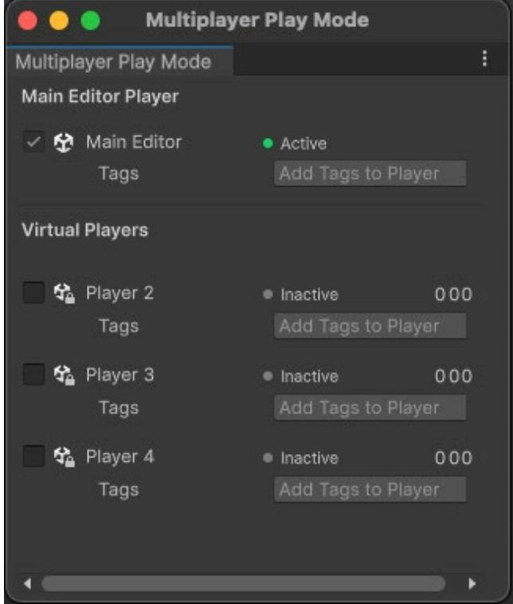

The Multiplayer Play Mode window

Then, check at least one additional Virtual Player from the list in the above screenshot, so you can test a minimum of one host and client. Remember that the host is a client that is also running on the server.

When entering Play mode, a second session of the application starts running in a cloned window.


Multiplayer Player Mode clones a Virtual Player.

Select the **NetworkManager** in the Hierarchy. Under **Start Connection** in the Inspector, select **Start Host**. The PlayerArmature\_Networked object appears in the Game view.

Use the Layout button in the second window to enable the Inspector and Hierarchy – much like a second session of the Editor. Select the user interface components to enable and press **Apply**.


Enable the Layouts in the cloned window.

In the cloned Editor window, locate the **NetworkManager** under **DontDestroyOnLoad** in the Hierarchy.

In the Inspector pane, under **Start Connection**, select **Start Client.**

| V Network Manager                 |                                  | 0 | 2 |   |
|-----------------------------------|----------------------------------|---|---|---|
| Run In Background                 | >                                |   |   |   |
| Log Level                         | Normal                           |   |   | D |
| Player Prefab                     | PlayerArmature_Networked         |   |   | 0 |
| > Network Prefabs Lists           |                                  | 1 |   |   |
| General                           |                                  |   |   |   |
| Protocol Version                  | 0                                |   |   |   |
| Network Transport                 | NetworkManager (Unity Transport) |   |   | 0 |
| Tick Rate                         | 30                               |   |   |   |
| Performance                       |                                  |   |   |   |
| Ensure Network Variable Lengt     |                                  |   |   |   |
| Connection                        |                                  |   |   |   |
| Connection Approval               |                                  |   |   |   |
| Client Connection Buffer Timer 10 |                                  |   |   |   |
| Spawning                          |                                  |   |   |   |
| Force Same Prefabs                | >                                |   |   |   |
| Recycle Network Ids               | >                                |   |   |   |
| Network Id Recycle Delay          | 120                              |   |   |   |
| Bandwidth                         |                                  |   |   |   |
| Rpc Hash Size                     | Var Int Four Bytes               |   |   | V |
| Scene Management                  |                                  |   |   |   |
| Enable Scene Management           | >                                |   |   |   |
| Load Scene Time Out               | 120                              |   |   |   |
| Start Connection                  |                                  |   |   |   |
|                                   | Start Host                       |   |   |   |
|                                   | Start Server                     |   |   |   |
|                                   | Start Client                     |   |   |   |

The NetworkManager contains buttons to connect the client.


Two instances of PlayerArmature\_Networked now appear in the Hierarchy. In the Scene view, they appear on top of one another. Using the keyboard or gamepad, move one player instance away from the other to separate them.

Select a PlayerArmature\_Networked instance in the Hierarchy to inspect its NetworkObject component.

At runtime, note how each instance is identified by its **GlobalObjectIdHash** (project asset ID) together with its **NetworkObjectId** (unique instance index). Below that, the **OwnerClientId** indicates whether the host or the client controls the instance.

Switch between the two instances to compare the flags: **IsSpawned**, **IsLocalPlayer**, **IsOwner**, **IsOwnerByServer**, etc.

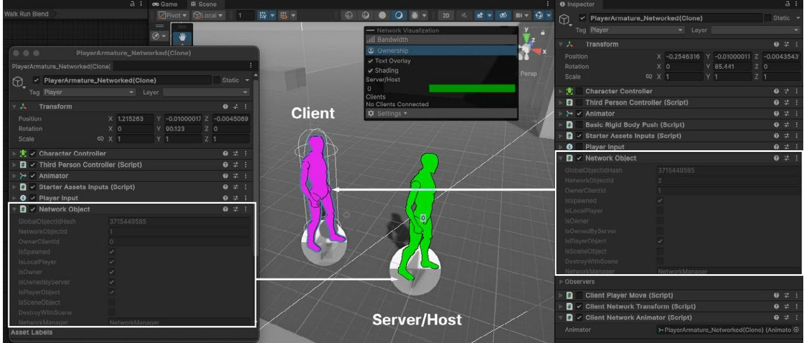

Compare the NetworkObject settings between the two instances.

Use the Network Visualization panel to distinguish between the two instances more clearly. This handy diagnostic tool appears in the Scene view once you've installed the Multiplayer Tools package.

The two instances are color coded by **Bandwidth** (how much data is being transmitted) or **Ownership** (which client has authority over the Player NetworkObject).

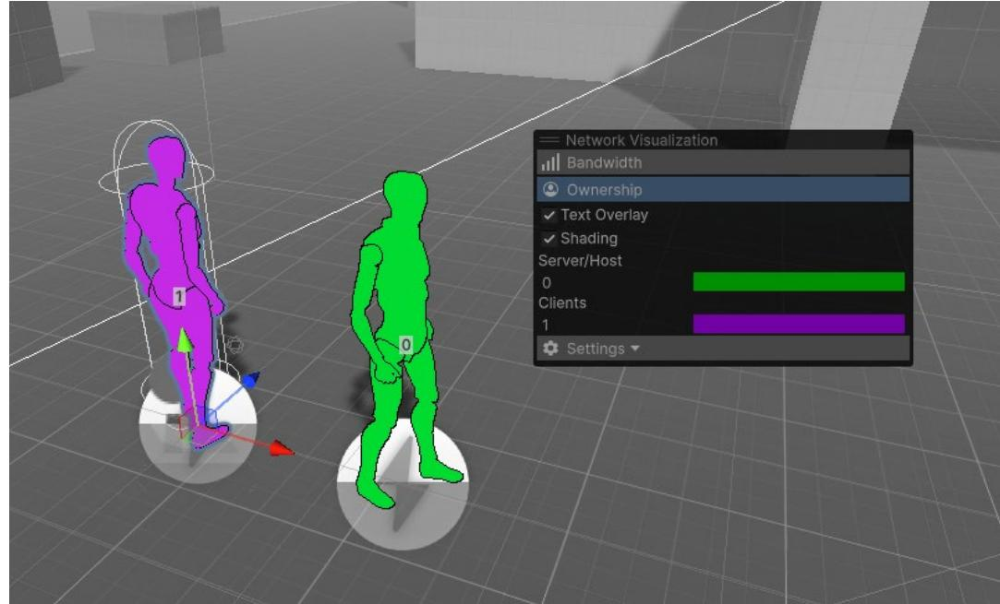

Network Visualization helps to debug the network objects.

Though the NetworkManager creates separate instances for each client, each independently controls the same character. In the Scene view, the character movements driven by WASD controls are not synchronized between the client and host.

Although the NetworkManager initially synchronizes their positions at coordinates (0, 0, 0) when players first connect, their subsequent movements are not. Currently several local components drive the character's behavior:

- A **CharacterController** allows for the player to move while interacting with the game environment, without requiring complex physics calculations.
- An **Animator** enables animation based on a state machine. The Animator controls the transitions and blending between running, jumping, or idle states.
- PlayerInput handles per-player input management, device pairing, and event notifications, providing a high-level wrapper around the Unity Input System.
- StarterAssetsInputs translates that input into values for the character's movement, look, jump, and sprint inputs.

These are single-player components. To make these work in a multiplayer application, we need to add some networked scripting.

<span id="page-39-0"></span>

### **Creating your own UI start buttons**

To create a more user-friendly way to start network sessions at runtime, you can add onscreen buttons that replicate the functionality of the NetworkManager's Inspector buttons. This can be achieved using either Unity UI (UGUI) or UI Toolkit.

In your UI of choice, create three buttons labeled Client, Host, and Server. Then, have them invoke these respective callbacks from the NetworkManager singleton:

- NetworkManager.Singleton.StartClient
- NetworkManager.Singleton.StartHost
- NetworkManager.Singleton.StartServer

These callbacks allow you to start the network session without using the buttons from the Inspector window.

## Adding NetworkBehaviour

To manage the MonoBehaviours on the PlayerArmature\_Networked, we can use a NetworkBehaviour.

A NetworkBehaviour is a specialized type of MonoBehaviour, designed for networked logic. It provides the framework necessary for synchronizing actions and states across different game clients.

NetworkBehaviour shares the same lifecycle events as MonoBehaviours but also incorporates several network-specific features:

**RPC Methods:** NetworkBehaviours can utilize remote procedure calls (RPCs) to handle communications across the network. These methods are annotated with the [Rpc] attribute. To send an Rpc to a server or client, call [Rpc(SendTo.Server)] and [Rpc(SendTo. Client)], respectively.

- **NetworkVariable:** This is a specialized variable designed for synchronized state management across the network. Changes to a NetworkVariable on the server are automatically propagated to all clients.
- **OnNetworkSpawn** and **OnNetworkDespawn**: These lifecycle methods are triggered when a NetworkBehaviour is instantiated or destroyed. OnNetworkSpawn is used for initialization (think of OnEnable or Start except for networked behavior). OnNetworkDespawn handles cleanup before an object is removed from the network (e.g., analogous to OnDestroy or OnDisable).
- **Ownership**: NetworkBehaviour allows specific clients (or the server) to have ownership over certain objects. This concept of authority, where either a client or the server can "own" a NetworkObject, ensures that only designated players should be able to control or interact with specific objects.


We can implement a NetworkBehaviour called ClientPlayerMove to manage the player movement. This can make sure that input from the host and the client only works on their respective player objects. Here's the example setup:

```
using Unity.Netcode;
using StarterAssets;
using UnityEngine;
using UnityEngine.InputSystem;
namespace NetcodeDemo
{
 public class ClientPlayerMove: NetworkBehaviour
 {
 [SerializeField]
 CharacterController m_CharacterController;
 [SerializeField]
 ThirdPersonController m_ThirdPersonController;
 [SerializeField]
 PlayerInput m_PlayerInput;

 [SerializeField]
 Transform m_CameraFollow;
 private void Awake()
 {
 m_PlayerInput.enabled = false;
 m_ThirdPersonController.enabled = false;
 m_CharacterController.enabled = false;
 }
 public override void OnNetworkSpawn()
 {
 base.OnNetworkSpawn();
 enabled = IsClient; // Enable if this is a client.
 if (!IsOwner)
 {
 // Disable if this is not the owner
 enabled = false;
 m_PlayerInput.enabled = false;
 m_CharacterController.enabled = false;
 m_ThirdPersonController.enabled = false;
 return;
 }

 // Enable if this is an owner
 m_PlayerInput.enabled = true;
 m_CharacterController.enabled = true;
 m_ThirdPersonController.enabled = true;

 }
 }
}
```


Add this to the PlayerArmature\_Networked prefab. Then fill out the appropriate fields in the Inspector.

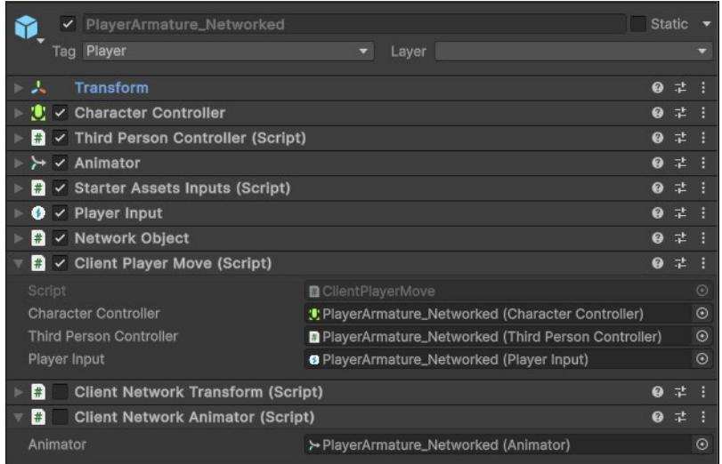

Fill out the ClientPlayerMove fields in the Inspector.

Once this script is applied to the prefab, connect the host and client sessions. When clients connect to the NetworkManager, certain components of the player object are disabled by default due to the IsOwner property, which checks if the local player is the owner of the instance.

In the Hierarchy, toggle the selection between the two instances of PlayerArmature\_ Networked.


Several components disable themselves if not the owner.

<span id="page-42-0"></span>

Note how several components (like the PlayerInput) now appear deactivated on player instances not owned by the respective client. For the host, this setup allows control over one of the player instances, and for the client, control over the other.

However, though we can control different player instances, their movements are not synchronized across the network. To make the movement match from host to client, we'll need to add additional network components like NetworkTransform.

#### **Authority and ownership properties**

By default, the server owns NetworkObjects, although connected and approved clients can also own NetworkObjects using the SpawnWithOwnership method. Netcode for GameObjects is server-authoritative, which means that only the server is authorized to spawn and despawn NetworkObjects.

NetworkBehaviour includes some quick ways to determine the authority and ownership of an instance:

- **IsClient** indicates if the instance is running on a client.
- **IsServer** indicates if the instance is running on a server.
- **IsHost** indicates if the instance is running on a host, which is both a server and a client.
- **IsLocalPlayer** indicates if the associated NetworkObject is the local player object.
- **IsOwner** indicates if the local player owns the object or if the object is the local player object.
- **IsPlayerObject** indicates if the GameObject represents a network player, typically controlled by a specific client.
- **IsSceneObject** indicates if the GameObject is part of the scene by default and not spawned dynamically during gameplay. A scene object is usually managed by the server for consistent state across the network.

Inspecting the NetworkObject at runtime shows some of these properties.

| The NetworkObject settings |  |  |
|----------------------------|--|--|

<span id="page-43-0"></span>

# Sync using a NetworkTransform and NetworkAnimator

Though the NetworkBehaviour lets us spawn the same player instance on multiple clients, synchronizing its movements across the network requires additional components.

Add a **NetworkTransform** component to the PlayerArmature\_Networked prefab. Uncheck any axes which won't affect gameplay; in this case, uncheck all scales, as well as x rotation and z rotation axes. Because synchronization uses bandwidth, it's essential to minimize syncing any superfluous data.

In Multiplayer Play Mode, focusing on the host window allows you to move the player using the controls and watch it sync to the client. This demonstrates the beginning of networked play.

Next add the **NetworkAnimator** component to the PlayerAramature\_Networked. Drag the existing Animator component into the empty field.

| V PlayerArmature_Networked                                                                                                      |                                                                                                                                                                                                                                                                                                                                                                | Static      |
|---------------------------------------------------------------------------------------------------------------------------------|----------------------------------------------------------------------------------------------------------------------------------------------------------------------------------------------------------------------------------------------------------------------------------------------------------------------------------------------------------------|-------------|
| Tag<br>Player                                                                                                                   | ><br>Layer                                                                                                                                                                                                                                                                                                                                                     | A           |
| 2<br>4<br>Transform                                                                                                             |                                                                                                                                                                                                                                                                                                                                                                | @<br>北<br>  |
| 9<br>✓ Character Controller<br>1                                                                                                |                                                                                                                                                                                                                                                                                                                                                                | 0<br>2<br>  |
| > Third Person Controller (Script)                                                                                              |                                                                                                                                                                                                                                                                                                                                                                | 0<br>2<br>  |
| Animator<br>1<br>V                                                                                                              | Assign to field                                                                                                                                                                                                                                                                                                                                                | 0<br>2<br>  |
| Starter Assets Inputs (Script)                                                                                                  |                                                                                                                                                                                                                                                                                                                                                                | 0<br>2<br>  |
| (1)<br>V Player Input<br>1                                                                                                      |                                                                                                                                                                                                                                                                                                                                                                | 0<br>北<br>  |
| #<br>V Network Object<br>12                                                                                                     |                                                                                                                                                                                                                                                                                                                                                                | 0<br>2<br>  |
| > Network Animator<br>2                                                                                                         |                                                                                                                                                                                                                                                                                                                                                                | 2<br>0<br>  |
| Animator                                                                                                                        | > PlayerArmature_Networked (Animator)                                                                                                                                                                                                                                                                                                                          | 0           |
| V Network Transform                                                                                                             |                                                                                                                                                                                                                                                                                                                                                                | 0<br>北<br>2 |
| Syncing<br>Position<br>Rotation<br>Scale                                                                                        | VX<br>VY<br>VZ<br>Uncheck<br>Z<br>VY<br>×<br>unused<br>r Z<br>×<br>EY<br>axes                                                                                                                                                                                                                                                                                  |             |
| Thresholds<br>Position Threshold<br>Rot Angle Threshold<br>Scale Threshold                                                      | 0.001<br>0.01                                                                                                                                                                                                                                                                                                                                                  | 0.01        |
| Delivery<br>Use Unreliable Deltas                                                                                               |                                                                                                                                                                                                                                                                                                                                                                |             |
| Configurations<br>In Local Space<br>Interpolate<br>Slerp Position<br>Use Quaternion Synchronization<br>Use Half Float Precision | 1 1 1 1 1 1 1 1 1 1 1 1 1 1 1 1 1 1 1 1 1 1 1 1 1 1 1 1 1 1 1 1 1 1 1 1 1 1 1 1 1 1 1 1 1 1 1 1 1 1 1 1 1 1 1 1 1 1 1 1 1 1 1 1 1 1 1 1 1 1 1 1 1 1 1 1 1 1 1 1 1 1 1 1 1 1 1<br>ﺍﻟﻤﺴﺘﻮﻯ ﺍﻟﻤﺴﺘﻮﻯ ﺍﻟﻤﺴﺘﻮﻯ ﺍﻟﻤﺴﺘﻮﻯ ﺍﻟﻤﺴﺘﻮﻯ ﺍﻟﻤﺴﺘﻮﻯ ﺍﻟﻤﺴﺘﻮﻯ ﺍﻟﻤﺴﺘﻮﻯ ﺍﻟﻤﺴﺘﻮﻯ ﺍﻟﻤﺴﺘﻮﻯ ﺍﻟﻤﺴﺘﻮﻯ ﺍﻟﻤﺴﺘﻮﻯ ﺍﻟﻤﺴﺘﻮﻯ ﺍﻟﻤﺴﺘﻮﻯ ﺍﻟﻤﺴﺘﻮﻯ ﺍﻟﻤﺴﺘﻮﻯ ﺍﻟﻤﺴﺘﻮﻯ ﺍﻟﻤﺴﺘﻮﻯ ﺍﻟﻤﺴﺘﻮﻯ ﺍﻟﻤﺴﺘﻮﻯ ﺍﻟﻤﺴﺘﻮﻯ ﺍﻟﻤﺴﺘ |             |

Add a NetworkTransform and NetworkAnimator component.

The client window represents a second machine that is connected to the host. Ideally, any actions performed on the host are reflected on the client and vice versa.

The NetworkTransform allows you to sync the position, rotation, and scale of a Transform, while the NetworkAnimator syncs the animation states. Now when your host player runs around the playground environment, its movements transfer to the client in Multiplayer Play Mode.

However, not everything works as expected. Switch focus to the client window and try using the controls. While the host syncs correctly to the client, the client's movements may not reflect on the host.

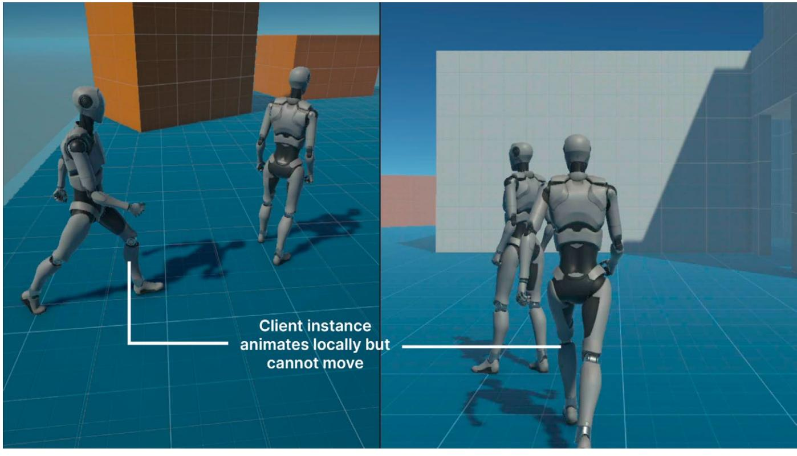

The player appears to run in place.

The client receives input, as indicated by the character animating in place, but the player instance doesn't move. This happens because the NetworkTransform operates under server authority, syncing only the server's position to the client.

When you try to move the player on the client, the server overrides the client's desired position, resetting it to (0, 0, 0).

<span id="page-45-0"></span>

# Applying client authority

By default, NetworkTransform operates in server authoritative mode. Changes to the transform axis are detected on the server-side and pushed to connected clients.

In our example, trying to transform the player on the client fails because the server – maintaining an authoritative state with the transform set to (0,0,0) – overrides these client-side changes.

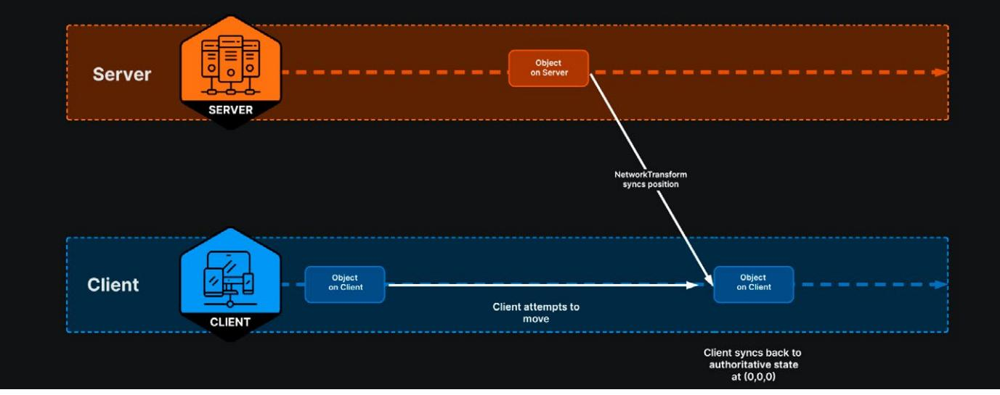

Server authority overrides the client.

To resolve this, one approach is to transfer authority from the server to the client. This allows the client to control its own transform without being overridden by the server.

To implement this behavior, we can create a **ClientNetworkTransform** component, as seen in the following code example, that switches the server authority for owner authority:

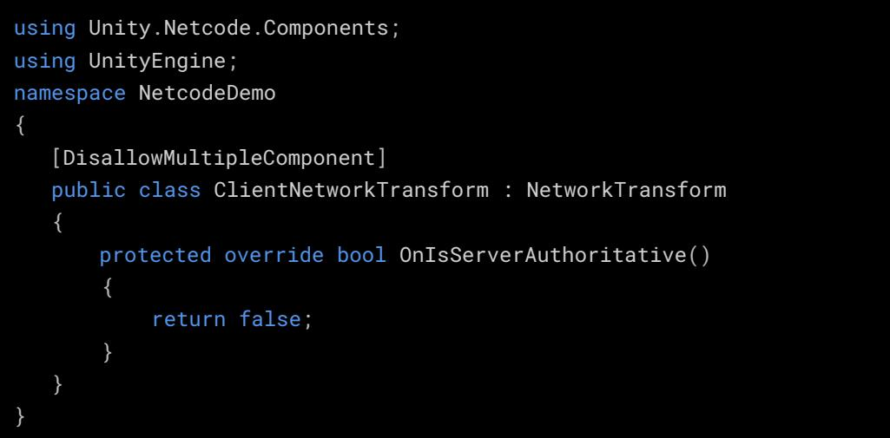


This overrides the OnIsServerAuthoritative method and returns false. On the Player NetworkObject prefab, replace the NetworkTransform with the custom ClientNetworkTransform.

Similarly, we can also create a client-driven NetworkAnimator:


Replace the NetworkAnimator with the **ClientNetworkAnimator**. Remember to set the Animator field in the Inspector.

| C > Character Controller<br>0<br>北<br>0<br>北<br>> Third Person Controller (Script)<br>@<br>14<br>V Animator<br>1<br>@<br>北<br>- Starter Assets Inputs (Script)<br>0<br>2<br>(1)<br>V Player Input<br>@<br>#<br>V Network Object<br>2<br>0<br>北<br>Client Player Move (Script)<br>@<br>Client Network Transform (Script)<br>2<br>Syncing<br>Position<br>VX<br>Rotation<br>××<br>VY<br>Z<br>Scale<br>X<br>TY<br>Thresholds<br>Position Threshold<br>0.001<br>Rot Angle Threshold<br>0.01<br>Scale Threshold<br>0.01<br>Delivery<br>Use Unreliable Deltas<br>Configurations<br>In Local Space<br>1<br>Interpolate<br>100<br>Slerp Position<br>Use Quaternion Synchronization<br>Use Half Float Precision<br>0<br>22<br>Client Network Animator (Script)<br>> PlayerArmature_Networked (Animator) | 1<br>Transform | @ | 2 |   |
|-----------------------------------------------------------------------------------------------------------------------------------------------------------------------------------------------------------------------------------------------------------------------------------------------------------------------------------------------------------------------------------------------------------------------------------------------------------------------------------------------------------------------------------------------------------------------------------------------------------------------------------------------------------------------------------------------------------------------------------------------------------------------------------------------|----------------|---|---|---|
|                                                                                                                                                                                                                                                                                                                                                                                                                                                                                                                                                                                                                                                                                                                                                                                               |                |   |   |   |
|                                                                                                                                                                                                                                                                                                                                                                                                                                                                                                                                                                                                                                                                                                                                                                                               |                |   |   |   |
|                                                                                                                                                                                                                                                                                                                                                                                                                                                                                                                                                                                                                                                                                                                                                                                               |                |   |   |   |
|                                                                                                                                                                                                                                                                                                                                                                                                                                                                                                                                                                                                                                                                                                                                                                                               |                |   |   |   |
|                                                                                                                                                                                                                                                                                                                                                                                                                                                                                                                                                                                                                                                                                                                                                                                               |                |   |   |   |
|                                                                                                                                                                                                                                                                                                                                                                                                                                                                                                                                                                                                                                                                                                                                                                                               |                |   |   |   |
|                                                                                                                                                                                                                                                                                                                                                                                                                                                                                                                                                                                                                                                                                                                                                                                               |                |   |   |   |
|                                                                                                                                                                                                                                                                                                                                                                                                                                                                                                                                                                                                                                                                                                                                                                                               |                |   |   |   |
|                                                                                                                                                                                                                                                                                                                                                                                                                                                                                                                                                                                                                                                                                                                                                                                               |                |   |   |   |
|                                                                                                                                                                                                                                                                                                                                                                                                                                                                                                                                                                                                                                                                                                                                                                                               |                |   |   |   |
|                                                                                                                                                                                                                                                                                                                                                                                                                                                                                                                                                                                                                                                                                                                                                                                               |                |   |   |   |
|                                                                                                                                                                                                                                                                                                                                                                                                                                                                                                                                                                                                                                                                                                                                                                                               |                |   |   |   |
|                                                                                                                                                                                                                                                                                                                                                                                                                                                                                                                                                                                                                                                                                                                                                                                               |                |   |   |   |
|                                                                                                                                                                                                                                                                                                                                                                                                                                                                                                                                                                                                                                                                                                                                                                                               |                |   |   |   |
|                                                                                                                                                                                                                                                                                                                                                                                                                                                                                                                                                                                                                                                                                                                                                                                               |                |   |   |   |
|                                                                                                                                                                                                                                                                                                                                                                                                                                                                                                                                                                                                                                                                                                                                                                                               |                |   |   |   |
|                                                                                                                                                                                                                                                                                                                                                                                                                                                                                                                                                                                                                                                                                                                                                                                               |                |   |   |   |
|                                                                                                                                                                                                                                                                                                                                                                                                                                                                                                                                                                                                                                                                                                                                                                                               |                |   |   |   |
|                                                                                                                                                                                                                                                                                                                                                                                                                                                                                                                                                                                                                                                                                                                                                                                               |                |   |   |   |
|                                                                                                                                                                                                                                                                                                                                                                                                                                                                                                                                                                                                                                                                                                                                                                                               |                |   |   |   |
|                                                                                                                                                                                                                                                                                                                                                                                                                                                                                                                                                                                                                                                                                                                                                                                               |                |   |   |   |
|                                                                                                                                                                                                                                                                                                                                                                                                                                                                                                                                                                                                                                                                                                                                                                                               |                |   |   |   |
|                                                                                                                                                                                                                                                                                                                                                                                                                                                                                                                                                                                                                                                                                                                                                                                               |                |   |   |   |
|                                                                                                                                                                                                                                                                                                                                                                                                                                                                                                                                                                                                                                                                                                                                                                                               |                |   |   |   |
|                                                                                                                                                                                                                                                                                                                                                                                                                                                                                                                                                                                                                                                                                                                                                                                               |                |   |   |   |
|                                                                                                                                                                                                                                                                                                                                                                                                                                                                                                                                                                                                                                                                                                                                                                                               | Animator       |   |   | O |

The ClientNetworkTransform and ClientNetworkAnimator.

<span id="page-47-0"></span>In Multiplayer Play Mode, you can now move the player from the client and its position and animation states should sync properly to the host.

Client-driven behaviors are also a way to reduce latency in networked applications. In "owner authoritative mode," networked behaviors can act immediately and responsively. The client doesn't need to wait for a packet to make a round trip to the server and back.

However, exercise care when creating such client-driven behaviors: they can improve the user experience for each player, but also introduce security risks. Owner authoritative mode opens your application to mods or hacks; in any online competitive game, players will cheat if given the chance. To prevent this and make your application more secure, opt for server authority.

#### **Owner authoritative mode components**

Though you can create the scripts in the above examples yourself, you can also get prebuilt ClientNetworkTransform and ClientNetworkAnimator components from the Multiplayer Samples Utilities package in the Unity project, *[Boss Room](https://unity.com/demos/small-scale-coop-sample)*. (com.unity. multiplayer.samples.coop).

Note that this implementation of the ClientNetworkTransform comes with potential issues:

- **Ownership transfer**: Ownership doesn't always switch smoothly, sometimes causing objects to jump or even get out of sync.
- **Hierarchical ownership:** There's no support for a ClientNetworkTransform as a child under a server-managed NetworkTransform.
- **Update rejection:** Servers can't reject updates from clients since the system only recognizes client ownership, not joint client-server ownership.
- **Object movement at instantiation**: The server can't move an object when it's first created under client ownership.

In many cases, the ClientNetworkTransform can be a viable way to handle client ownership transforms. However, consider these limitations before implementing them as part of your project.

## Syncing with server authority

Though you can allow some client authority for responsive gameplay, some movements can only be done on the server side. Generally, you should use server authority to prevent any potential imbalances or unfair advantages that could arise from client-controlled actions.

For instance, allowing clients to choose their spawn locations on the game map could give them an undue advantage, depending on the layout of the map. Instead, it's more equitable to have the server randomly assign them to one of a set of predetermined spawn points.

To manage this, define some objects with some simple visuals and then scatter them where you want players potentially to spawn.

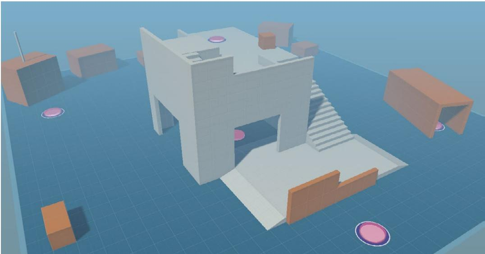

Spawn points are strategically placed throughout the level.

A non-networked MonoBehaviour can manage them. Here, the ServerPlayerSpawnPoints class contains a list called m\_SpawnPoints that references each spawn point GameObject.

This sample implementation also uses a generic singleton pattern, borrowed from the Unitymade Asset Store project *[Level up your code with design patterns and SOLID](https://assetstore.unity.com/packages/essentials/tutorial-projects/level-up-your-code-with-design-patterns-and-solid-289616)*:

```
public class ServerPlayerSpawnPoints : Singleton<ServerPlayerSpawnPoints>
{
 [SerializeField]
 private List<GameObject> m_SpawnPoints;
 public GameObject GetRandomSpawnPoint()
 {
 if (m_SpawnPoints.Count == 0)
 return null;
 return m_SpawnPoints[Random.Range(0, m_SpawnPoints.Count)];
 }
}
```
A NetworkBehaviour called ServerPlayerMove can then use the instance of ServerPlayerSpawnPoints to pick a spawn point at random.


```
using Unity.Netcode;
using UnityEngine;
[DefaultExecutionOrder(0)] // Execute before ClientNetworkTransform
public class ServerPlayerMove : NetworkBehaviour
{
 public override void OnNetworkSpawn()
 {
 // Only execute on the Server
 if (!IsServer)
 {
 enabled = false;
 return;
 }
 SpawnPlayer();
 base.OnNetworkSpawn();
 }
 // Move to the next available position when spawning
 void SpawnPlayer()
 {
 var spawnPoint = ServerPlayerSpawnPoints.Instance.GetRandomSpawnPoint();
 var spawnPosition = spawnPoint ? spawnPoint.transform.position : Vector3.zero;
 transform.position = spawnPosition;
 }
}
```
All of the logic happens in OnNetworkSpawn. Every time a client connects, a call to SpawnPlayer starts the player at a randomly selected spawn. The IsServer check makes sure that this only happens on the server, which maintains the authoritative game state.

Add the ServerPlayerMove script to the PlayerArmature\_Networked prefab. When you enter Multiplayer Play Mode, each client will connect and spawn at a random point within the playground environment.

This implementation shows how NetworkBehaviours can interact with elements in the scene that aren't network-controlled. Here, it leverages static data and scene objects already set up in the Hierarchy.

When a client connects, the ServerPlayerMove only needs to retrieve one random spawn point from the existing gameplay scene. This limits the amount of data transmitted over the network.

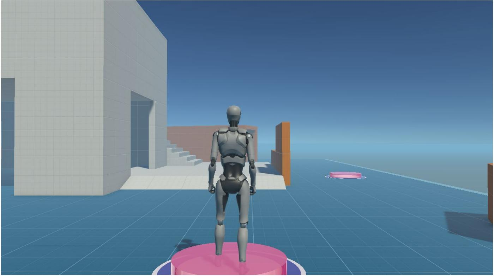

The player appears at a random spawn point.

Some important points:

- Because the ClientNetworkTransform is owner authoritative, it's important to disable the CharacterController component during Awake. Re-enable the CharacterController after ServerPlayerMove positions the player to prevent it from overriding the calculated values and resetting to world center.
- Likewise, fill out the m\_SpawnPoints in the Inspector to prevent the players from spawning at (0,0,0).
- Set the DefaultExecutionOrder attribute with a lower value to ensure that ServerPlayerMove executes before ClientPlayerMove. For example, using [DefaultExecutionOrder(0)] prioritizes ServerPlayerMove, allowing it to run first.

Our multiplayer project now has the capability of connecting multiple clients to a host. In the game, third-person player characters are able to spawn at designated positions within the level and synchronize their movements and animations in real-time.

This synchronization is essential for the multiplayer experience. Components such as NetworkTransform and NetworkAnimator facilitate this process right out of the box, but for gameplay, you'll need to customize your own NetworkBehaviours as well.

<span id="page-51-0"></span>

Next, let's explore additional methods for synchronizing data and game states across the network.

#### **Singleton design pattern**

A singleton provides a convenient means of accessing a unique instance of a particular type at runtime. However, singletons can introduce extra dependencies, so be aware of their drawbacks.

In Netcode for GameObjects, you'll use singletons every time you refer to the NetworkManager.Singleton. The sample project also includes an example of a generic singleton for use with any MonoBehaviour type.

For a deeper understanding of singletons, refer to the e-book *[Level up your code with](https://unity.com/resources/design-patterns-solid-ebook)  [design patterns and SOLID](https://unity.com/resources/design-patterns-solid-ebook)*. This guidebook also demonstrates alternative patterns like events or event channels for object communication in your scene.

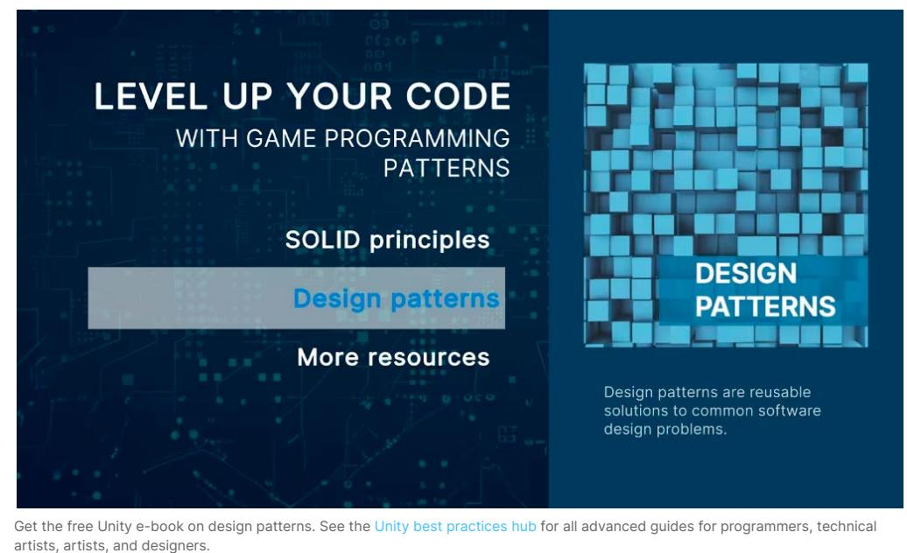

# <span id="page-52-0"></span>Network synchronization

Network synchronization is essential for maintaining a consistent – and fair – gaming experience for all players.

You've already seen how to synchronize player movements and animations with the Player NetworkObject using a client-driven model. However, gameplay often involves more than just the player character. Depending on your game design, your player may need to shoot projectiles, open doors, or interact with other scene objects. These interactions will need to be networkable, with their own game states that need to be synced between the clients and the server.

In this section, we will set up client-server communication for gameplay actions, where the player may interact with part of the game environment. This involves implementing networked game states and sending [remote procedure calls \(RPCs\)](https://docs-multiplayer.unity3d.com/netcode/current/advanced-topics/messaging-system/) to and from the server.

# Gameplay mechanic

To illustrate server-client communication, let's recreate a simple game mechanic.

Let's start by adding Trigger Colliders to the game level that change color when making contact with a player. They can change one color when one player touches it and another color when a different player touches it.

In the scene, create a new GameObject (e.g., a cube). Add a BoxCollider component and enable the IsTrigger option. Create and assign a transparent material to the MeshRenderer (this example uses the URP/Lit shader). Set its initial color to something neutral like white.

<span id="page-53-0"></span>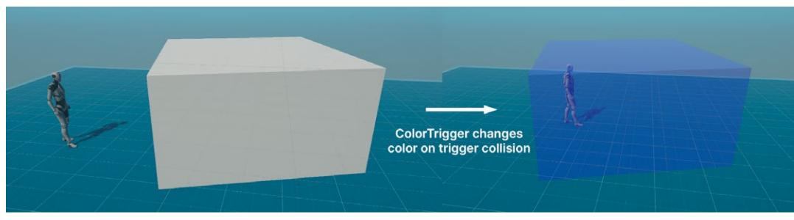

The trigger will receive a networked color value.

Next, we need to add network synchronization. Let's use NetworkVariables and RPCs to synchronize the color change across the network.

# Define a NetworkVariable

A NetworkVariable is a specialized variable designed for synchronized state management across the network. Changes to a NetworkVariable on the server propagate to all clients. This is ideal for continuously synchronized data, such as positions, health points, or in this case, the color state of the trigger.

We'll create a NetworkBehaviour called ColorTrigger and attach it to the trigger object. This script will contain a NetworkVariable called m\_NetworkColor that contains a Color value.

```
using UnityEngine;
using Unity.Netcode;
public class ColorTrigger : NetworkBehaviour
{
 public NetworkVariable<Color> m_NetworkColor = new NetworkVariable<Color>(Color.
white);
 private Material m_InstanceMaterial;
 public override void OnNetworkSpawn()
 {
 m_NetworkColor.OnValueChanged += OnColorChanged;
 MeshRenderer meshRenderer = GetComponent<MeshRenderer>();
 if (meshRenderer != null)
 {
 m_InstanceMaterial = new Material(meshRenderer.material);
 meshRenderer.material = m_InstanceMaterial;
 UpdateMaterialColor(m_NetworkColor.Value);
 }
 }
```
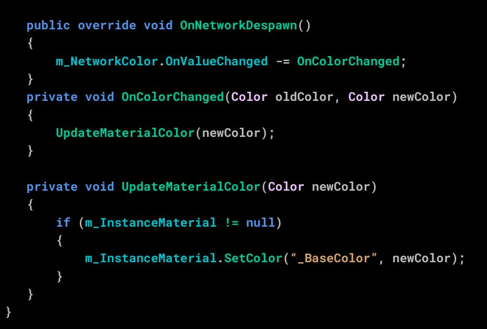

When a player enters the trigger, this script will toggle the base color property of its material instance. The script uses a NetworkVariable called m\_NetworkColor.

Here's a breakdown of how this works:

- This NetworkVariable keeps track of the actual color value and then syncs across all clients. Though the script runs on both the server and the clients, by default, only the server has write permissions to the NetworkVariable. Clients can only read its Color value.
- The OnValueChanged event updates the trigger's material base color whenever the NetworkVariable changes. The script subscribes to the event in OnNetworkSpawn and unsubscribes in OnNetworkDespawn.

While a NetworkTransform is specific to syncing transform data (position, rotation, scale), a NetworkVariable can sync more general data types, including primitive types, custom structs, and other data necessary for game state management.

When working on a client, you can't change the NetworkVariable directly because it is serverauthoritative. Instead, the client must notify the server to make any changes. The server updates the state and propagates it back, and only then does the client see the change take effect.

To handle communication for changes like this, we use an RPC. RPCs can allow one device to require another device to perform specific actions or updates. RPCs can be called from the client to the server, or vice versa.

<span id="page-55-0"></span>Let's look at how to implement an RPC for this purpose.


A server RPC runs remotely from the client to the server.

# Adding an RPC

RPCs allow you to invoke functions on the server or other clients remotely. Methods marked with [Rpc(SendTo.Server)] are called on the server from a client, and those marked with [Rpc(SendTo.Client)] are called on clients from the server. You can also use the legacy syntax [ServerRpc] or [ClientRpc] to indicate a server RPC or client RPC here.

RPCs are much like other methods, except they must follow a few conventions:

- **Rpc attribute:** Annotate your method with the [Rpc] attribute and specify a possible target, e.g., [Rpc(SendTo.Server)] will call the method only on the server.
- **Naming convention:** End the method name with the suffix "Rpc" e.g., DoSomethingRpc.

RPCs are better suited for discrete events, such as player actions or specific game state changes that do not need continuous synchronization.

Append these methods to the TriggerColor script:

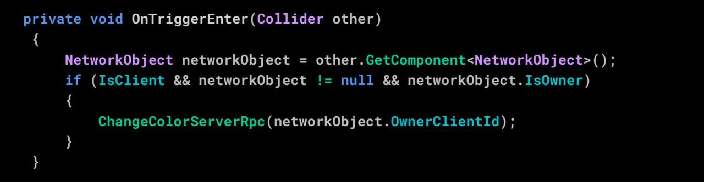


In a single-player game, you could add the appropriate logic to OnTriggerEnter. However, in a multiplayer game, you typically handle interactions using client-server communication to ensure that all clients remain in sync.

Instead of setting the m\_NetworkColor value directly, OnTriggerEnter checks if the current game instance is a client. If it is, it calls ChangeColorServerRpc and passes in the OwnerClientId.

This method determines the new color based on the player's ID (in this example, even ID numbers become blue, while odd IDs become red) and updates the m\_NetworkColor value.

This change is propagated to all connected clients, ensuring every game instance has a consistent view of the game state. When the m\_NetworkColor changes, the OnColorChanged method is triggered on all clients, updating the trigger's material color.

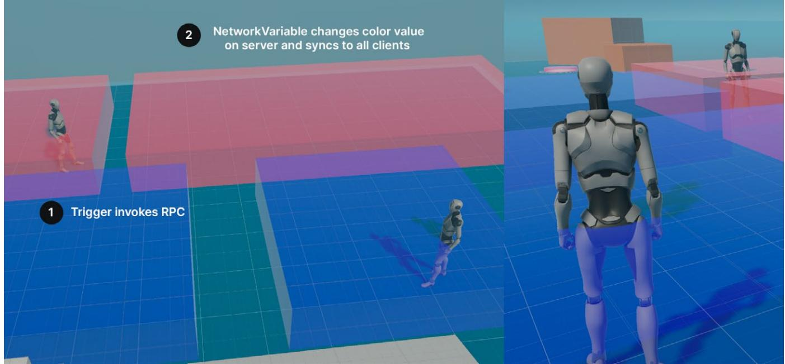

This simple game mechanic shows client-server interactions.

### <span id="page-57-0"></span>**Trigger mechanic**

Even though this is a simple example, similar game mechanics can be found in many multiplayer games where the player's actions can trigger visual changes to the environment. For example:

- In a cooperative puzzle game, players may need to use buttons or triggers to interact with the environment. The visual cues that happen in the game environment serves as a signal for everyone to coordinate their actions.
- In a competitive shooter, players can take control points on the level. These often change color to the team that controls them. Again, this doubles as a visual cue to players to adjust their strategies accordingly.
- In online RPGs, specific areas of the level can trigger buffs, debuffs, or other effects.

# RPCs versus NetworkVariables

When synchronizing data, choosing between NetworkVariables and RPCs depends on the use case:

- NetworkVariables and NetworkTransforms are ideal for continuously synchronized data, such as positions, health points, or in this case, the color state of the trigger. Here, the color trigger uses a NetworkVariable to store its active color.
	- Use cases: Health points, positional data, game scores
- Remote procedure calls (RPCs) are better suited for discrete events, such as player actions or specific game state changes that do not need continuous synchronization. In this example, the RPC notifies all clients when a player enters the trigger zone, prompting the server to change the color based on the player's ID.
	- Use cases: Player actions (e.g., shooting, using an ability), game events (e.g., spawning, game start, game won)

Both mechanisms are essential for data synchronization in networked games, where NetworkVariables manage ongoing states and RPCs handle specific events and actions. <span id="page-58-0"></span>These gameplay examples can help you determine when to use NetworkVariables or RPCs.

| Task/system                   | RPCs                                                                                                | NetworkVariables                                                                                                                   |
|-------------------------------|-----------------------------------------------------------------------------------------------------|------------------------------------------------------------------------------------------------------------------------------------|
| Inventory<br>management       | Notify clients when an item is<br>picked up or used, to be added<br>or removed from the inventory.  | Maintain the current inventory for<br>each player. The inventory can be a<br>NetworkList that syncs the list of items.             |
| Combat<br>systems             | Execute combat actions like<br>attacks or special moves. An<br>RPC can apply damage and<br>effects. | Track the health and status of each<br>player. Health points and active<br>status effects can be synced using<br>NetworkVariables. |
| Environmental<br>interactions | Trigger specific actions like<br>opening a door or activating a<br>mechanism.                       | Maintain the state of interactive<br>objects, such as whether a door is<br>open or closed.                                         |
| Objectives                    | Signal the completion of an<br>objective.                                                           | Track ongoing progress toward an<br>objective. Store the number of items<br>collected or completed tasks in a<br>NetworkVariable.  |

For a more detailed discussion, see the [RPC vs NetworkVariable documentation page](https://docs-multiplayer.unity3d.com/netcode/current/learn/rpcvnetvar/).

# Designing for multiplayer

Now that you're familiar with the basics of netcode, it's essential to adopt a "networked multiplayer" mindset when creating your games. What might be simple in a single-player game often becomes more complex when we need to incorporate NetworkVariables or RPCs to create the same behavior over multiple devices.

Plan how you'll synchronize the states between clients and the server. Use NetworkVariables for continuously synced data and RPCs for discrete events. Then, make sure to minimize network traffic by syncing only what's necessary.

While it's possible to convert a single-player game into a multiplayer game, it's usually more efficient to design with multiplayer in mind from the start. Decide early which objects and actions will be owned by the server and which can be managed by the clients. While server authority offers the most security and consistency, balance that with client authority to reduce latency for certain actions.

This latency can be a sore sticking point in building your networked game, so let's next examine how it impacts the multiplayer experience.

For some inspiration, see [this Unite 2024 session](https://www.youtube.com/watch?v=UiAhrW8i7oA) that explores the most common and significant mistakes in making a multiplayer game, and how to avoid them to improve your chances of success.

# <span id="page-59-0"></span>Network latency and performance

If you've ever played an online game, you likely have firsthand experience with how latency can detract from the experience. Poor bandwidth and unstable networking connections lead to jerky player movement, inconsistent frame rates, and noticeable input lag.

Now that you understand how clients and servers communicate, you can appreciate why this happens. With the internet filling the gap between your devices, a lot can go wrong. Even with the extra reliability of Unity Transport, UDP packets can get lost, arrive out of order, or get damaged on the way to their destination. These are potential sources of latency, also perceived as lag.

# Simulating latency

To understand and mitigate the effects of latency during development, you can simulate various network conditions in the Unity Editor using either the Debug Simulator in the UnityTransport or Network Simulator.

## **Unity Transport Debug Simulator**

Adjust the Debug Simulator in the [UnityTransport component t](https://docs.unity3d.com/Packages/com.unity.transport@2.4/manual/index.html)o introduce artificial latency, jitter, and packet loss. You can find these settings in the Inspector when selecting the NetworkTransport object in your scene. Set a few values to recreate network congestion:

**Latency:** Add a delay in milliseconds to simulate slower network connections. For example, set latency to 100ms to mimic moderate network delay.

<span id="page-60-0"></span>**Jitter:** Introduce variability in latency to simulate fluctuating network conditions. For instance, set jitter to 50ms to see how unstable connections affect gameplay.

**Packet Loss:** Specify a percentage of packets to drop, mimicking poor connection quality. Try setting packet loss to 5% to understand its impact on gameplay.

Play the game application again to observe how these simulated conditions affect gameplay.

| T / Unity Transport                                                                                                | 2                    |  |  |  |
|--------------------------------------------------------------------------------------------------------------------|----------------------|--|--|--|
| Protocol Type                                                                                                      | Unity Transport<br>œ |  |  |  |
| Use Web Sockets                                                                                                    |                      |  |  |  |
| Use Encryption                                                                                                     |                      |  |  |  |
| Max Packet Queue Size                                                                                              | 128                  |  |  |  |
| Max Payload Size                                                                                                   | 6144                 |  |  |  |
| Heartbeat Timeout MS                                                                                               | 500                  |  |  |  |
| Connect Timeout MS                                                                                                 | 1000                 |  |  |  |
| Max Connect Attempts                                                                                               | 60                   |  |  |  |
| Disconnect Timeout MS                                                                                              | 30000                |  |  |  |
| Debug Simulator                                                                                                    |                      |  |  |  |
| Packet Delay MS                                                                                                    | 2000                 |  |  |  |
| Packet Jitter MS                                                                                                   | 50                   |  |  |  |
| Packet Drop Rate                                                                                                   | 10                   |  |  |  |
| MUCH FO                                                                                                            | TARREN               |  |  |  |
| Port                                                                                                               | 7777                 |  |  |  |
| It's recommended to leave remote connections disabled for local testing to avoid exposing<br>ports on your device. |                      |  |  |  |
| Allow Remote Connections?                                                                                          |                      |  |  |  |
| Override Bind IP (optional)                                                                                        |                      |  |  |  |

Adjust the Debug Simulator of the Unity Transport.

### **Network Simulator**

The [Network Simulator](https://docs-multiplayer.unity3d.com/tools/current/tools-network-simulator/) from the Multiplayer Tools package lets you test less-than-ideal network conditions. This can help you discover and fix issues before they surface in production. It facilitates simulating [network events,](https://docs-multiplayer.unity3d.com/tools/current/tools-network-simulator/#network-events) such as network [disconnects,](https://docs-multiplayer.unity3d.com/tools/current/tools-network-simulator/#disconnects) [lag spikes,](https://docs-multiplayer.unity3d.com/tools/current/tools-network-simulator/#lag-spikes) and [packet loss](https://docs-multiplayer.unity3d.com/tools/current/tools-network-simulator/#packet-loss).

| 0 0 0                                                                      | Multiplayer Tools                          |              |                 |
|----------------------------------------------------------------------------|--------------------------------------------|--------------|-----------------|
| Multiplayer Tools                                                          |                                            |              |                 |
| X<br>Tools                                                                 |                                            |              |                 |
| Network Scene Visualization @                                              |                                            |              | Open            |
| Available                                                                  |                                            |              |                 |
| Runtime Network Stats Monitor @                                            |                                            |              | Add to scene    |
| Available                                                                  |                                            |              |                 |
| Network Simulator @                                                        |                                            | Add to scene |                 |
| Available                                                                  |                                            |              |                 |
| Open<br>Network Profiler @                                                 |                                            |              |                 |
| Available<br>>                                                             |                                            |              |                 |
| Installed Packages                                                         |                                            |              | Package Manager |
| · Unity Transport version: 2.1.0 %<br>· Multiplayer Tools version: 2.1.0 % | · Netcode for GameObjects version: 1.9.1 @ |              |                 |

Install the Network Simulator from the Multiplayer Tools package.

<span id="page-61-0"></span>

| V Network Simulator                                            | 3  | 1  |   |  |  |
|----------------------------------------------------------------|----|----|---|--|--|
| Connection Preset Home Broadband [WIFI, Cable, Console, PC]    |    |    | œ |  |  |
| Custom Preset<br>None (Network Simulator Preset Asset)         | 0  |    |   |  |  |
| Parameters                                                     |    |    |   |  |  |
| Built-in connection types cannot be edited.                    |    |    |   |  |  |
| Packet Delay Range (ms) 20<br>Glo                              |    | 44 |   |  |  |
| Packet Delay (+ms)                                             |    | 32 |   |  |  |
| Packet Jitter (±ms)                                            | 12 |    |   |  |  |
| Packet Loss (%)                                                | 2  |    |   |  |  |
| Packet Loss Interval                                           | 0  |    |   |  |  |
| Disconnected<br>Connected<br>· Connection                      |    |    |   |  |  |
| Duration of lag spike (ms)                                     |    |    |   |  |  |
| 100<br>2000<br>5000<br>200<br>500<br>1000                      | 0  |    |   |  |  |
| Trigger                                                        |    |    |   |  |  |
|                                                                |    |    |   |  |  |
| Network Scenarios                                              |    |    |   |  |  |
| Connections Cycle<br>Scenario                                  |    |    |   |  |  |
| Auto Run Scenario                                              |    |    |   |  |  |
| V Scenario                                                     |    |    |   |  |  |
| Configurations                                                 | 1  |    |   |  |  |
| None<br>Connection Preset                                      |    |    |   |  |  |
| Scriptable Object Preset None (Network Simulator Preset Asset) |    | 0  |   |  |  |
| Change Interval Millisecond 5000                               |    |    |   |  |  |
|                                                                | +  |    |   |  |  |
| Start                                                          |    |    |   |  |  |

Test latency in the Network Simulator.

#### **Other network conditioners**

The Debug Simulator or the Network Simulator only work in the Editor, however. For runtime builds, alternative network conditioners can be used to simulate latency. Tools such as [clumsy](https://github.com/jagt/clumsy?tab=readme-ov-file) for Windows and Network Link Conditioner for macOS/iOS can recreate various network conditions for thorough testing.

For more information see the [Testing and Debugging](#page-71-0) section further on in this guide.

Dealing with the impact of latency on application performance is one of the biggest challenges in multiplayer development. Fortunately there are some strategies to help mitigate the effects of latency. Let's explore a few of them here.

<span id="page-62-0"></span>

# Client-side interpolation

One way to reduce the effects of latency is client-side interpolation. In this method, each client intentionally delays rendering by a short interpolation period, rather than rendering it right away.

In client-server topology, clients generally render a state that is about half the round-trip time (RTT) behind the server. Client-side interpolation adds an extra intentional delay on top of that.

By running slightly behind, clients can buffer incoming state updates from the server. When it's time to render the next update, the client calculates an interpolated state from the two most recent server ticks.

The buffer allows the client to render regular client updates, even if ticks from the server arrive at a jittered, irregular rate. The interpolated states conceal minor latency or jitter.

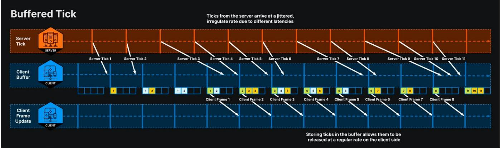

The client renders interpolated states from a buffer.

Client-side interpolation is available in Netcode for GameObjects as a flag on the NetworkTransform component. Enabling **Interpolation** interpolates position, rotation, and scale for the associated GameObject.

| V Network Transform            |                   | @ 花  |
|--------------------------------|-------------------|------|
| Syncing                        |                   |      |
| Position                       | VX<br>Y<br>Z<br>V |      |
| Rotation                       | ×<br>><br>Y<br>Z  |      |
| Scale                          | X<br>Z<br>- Y     |      |
| Thresholds                     |                   |      |
| Position Threshold             | 0.001             |      |
| Rot Angle Threshold            |                   | 0.01 |
| Scale Threshold                | 0.01              |      |
| Delivery                       |                   |      |
| Use Unreliable Deltas          |                   |      |
| Configurations                 |                   |      |
| In Local Space                 |                   |      |
| Interpolate                    | >                 |      |
| Slerp Position                 |                   |      |
| Use Quaternion Synchronization |                   |      |
| Use Half Float Precision       |                   |      |

Client-side interpolation enabled on the NetworkTransform.

<span id="page-63-0"></span>

Just bear in mind that client-side interpolation introduces a slight delay in rendering, which is necessary for the interpolation.

# Client-side prediction and anticipation

In our earlier example, the ClientNetworkTransform gives the client direct control over player movement, making the game feel more responsive and instant. However, it's important to note that client authority is not possible in many games due to a number of factors, such as game design, fairness, and security.

#### **Why server authority**

In competitive games where fair competition is crucial, client authority can give players the ability to cheat or exploit the game by manipulating the client-side code or data. Games with complex player interaction and shared game worlds often require server authority to ensure data integrity, prevent tampering, and maintain a consistent experience for all players. Here, server authority is required to ensure a level playing field and maintain the integrity of the game.

This means using the standard NetworkTransform component instead of the ownerauthoritative ClientNetworkTransform. This ensures that client input does not control the player; instead, only the server will have control.

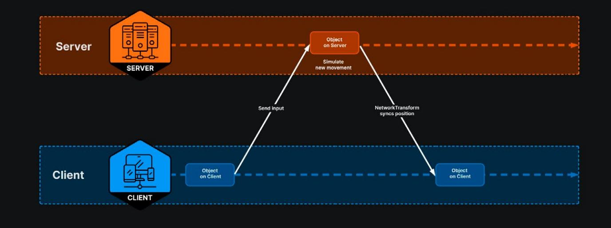


Server authority, however, can exacerbate latency. Instead of manipulating an onscreen player directly, each client must send its inputs to the server. The server then processes those inputs to simulate the game and calculates the game state. Only when the client receives the results of that simulation can it display the next frame.

When using an authoritative server, players perceive latency because of the time it takes for data to travel from the client to the server and back again. In this scenario, clients tend to lag behind the server, especially as your UDP packets need to traverse the internet.

<span id="page-64-0"></span>

For many elements in a game, this lag might be acceptable, but for others, like the player's character, such lag can ruin the feel of the game and make it difficult to play.

### **How client-side prediction works**

Client-side prediction offers one solution to the lag introduced by server authority. Instead of waiting for the server's response, the client predicts the game state a fraction of a second into the future and updates the game visually. This is called "prediction" because the client predicts the game state without knowing the true state from the server.

By doing this, the client can provide instant visual feedback to the player's actions, making the game feel responsive.

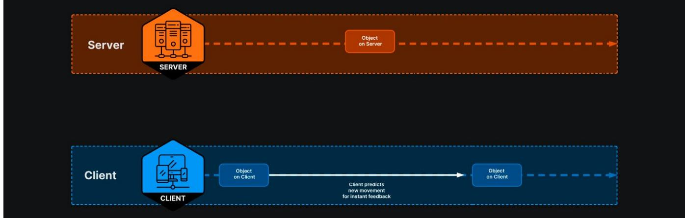

Client predicts the game state.

Simultaneously, the client sends the player's actions to the server in a packet. The server receives the client's input packet and simulates the game state using those inputs. The server processes these inputs to simulate the game state, establishing the authoritative game state as the ground truth. The server sends that authoritative state back to the client.


The server sends back the authoritative state.

<span id="page-65-0"></span>

#### **Reconciliation and rollback**

The client then compares the authoritative state with the anticipated state and looks for any differences. If the two states are close enough, then nothing happens and the client continues playing.

If there is a significant mismatch – also called a "desync" – then, the client must decide how to correct its state to match the server's authoritative state. This process is called **reconciliation**.

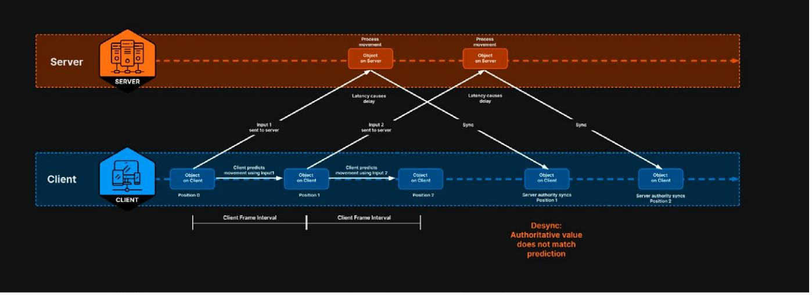

The client receives a mismatched state, or "desync."

To handle latency and compensate for it, the client stores a history of its inputs and predicted state for a certain number of frames. When a desync occurs, the client can roll back its state to the last known correct state from the server. Then, it re-simulates the game from that point using the correct inputs. This brings the client state back in sync with the server.


The client reconciles the desync.

<span id="page-66-0"></span>On any given frame, the client may need to re-simulate several frames, which is why a networked application can be more computationally expensive. This reconciliation and rollback, however, is what helps maintain a smooth and consistent experience for the player even with the presence of network latency.

### **Client-side anticipation in Netcode for GameObjects**

Netcode for GameObjects supports client anticipation, a simplified model for handling latency without full client-side prediction and reconciliation. It uses these components:

- AnticipatedNetworkVariable<T> is a generic component used for scalar or simple data types like integers, floats, and colors. It's suitable for non-transform properties such as health, score, or item states.
- AnticipatedNetworkTransform works similarly to AnticipatedNetworkVariable but is designed for Transform data, including position, rotation, and scale.

Client anticipation allows the client to provide immediate visual feedback to the user while waiting for the server's authoritative update. This helps make the game feel more responsive. In our simple ColorTrigger example, when a player changes the color of an object from white to blue, the client can visually update the color immediately while waiting for the server to confirm the change.

Between the client and server, anticipation would look something like this:

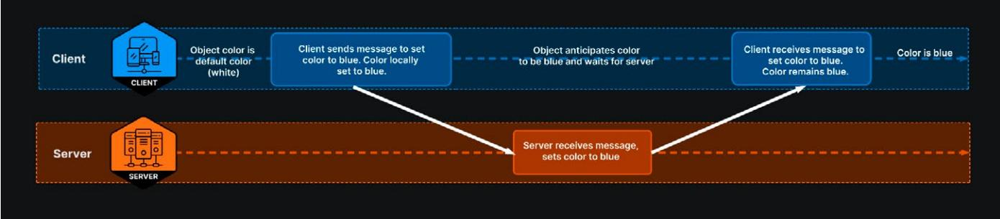

The client anticipates the game state.

AnticipatedNetworkVariable<T> and AnticipatedNetworkTransform both work by separating values into anticipated (visual) and authoritative states.

Anticipation refers to the client's predicted state, which provides immediate visual feedback to the player locally. The authoritative state is determined by the server. When the server's update arrives, the client compares its anticipated state with the authoritative state. If they differ significantly, the client adjusts its state to match the server's, ensuring consistency across all clients.

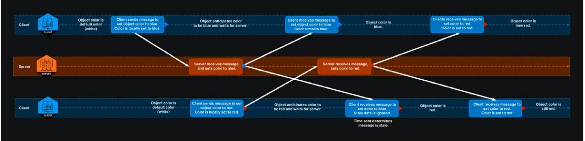

Client anticipation can ignore stale data.

Client anticipation also needs to account for "stale data" – updates from the server that reflect actions occurring before the client's last request. Netcode for GameObjects provides two ways to handle this through the StaleDataHandling property:

- StaleDataHandling.Ignore ignores stale data and keeps the anticipated value. This can be useful if the state is changing rapidly and causing visual flickering.
- StaleDataHandling.Reanticipate treats stale data like any other server update, triggering rollback and re-anticipation, which replays player inputs to maintain consistency.

To prevent choppy visual updates when server values differ from anticipated values, use the Smooth method available to both components.

Smooth requires a starting value, a final value, and a duration for the smoothing process. This helps maintain a smooth and responsive visual experience despite network latency.

While client anticipation improves gameplay responsiveness, this simplified approach may not cover all cases of latency and network issues.

Note that true rollback and reconciliation require a deterministic physics system, which ensures that the same inputs will always produce the same results (below). This is essential for accurately rolling back and resimulating game states. Without determinism, discrepancies can arise between the server and client simulations.

Netcode for GameObjects does not support deterministic physics, which is necessary for true client prediction and lag compensation. Instead, Netcode for GameObjects provides a simpler solution that focuses on client anticipation and smoothing. This can improve responsiveness without a full rollback system.

### <span id="page-68-0"></span>Deterministic physics

A [deterministic](https://en.wikipedia.org/wiki/Deterministic_system) physics system ensures that given the same initial conditions and inputs, the physics simulation will always produce the same results.

Note that Netcode for GameObjects uses Unity's built-in physics engine, which is not deterministic. When re-running the simulation with the same inputs, the physics system does not guarantee identical results.

Netcode for Entities, however, supports [Unity Physics](https://docs.unity3d.com/Packages/com.unity.physics@1.3/manual/index.html) and [Havok Physics,](https://docs.unity3d.com/Packages/com.havok.physics@1.3/manual/index.html) both of which offer deterministic simulation capabilities. This allows Netcode for Entities to support true client-side prediction.

#### **Client-side prediction in Netcode for Entities**

Netcode for Entities offers advanced tools for handling client-side prediction and lag compensation. The same simulation code runs on both the client and the server for each entity. This allows the client to predict the state of the game based on player inputs, giving immediate feedback without waiting for the server's response.

When the client receives the latest snapshot from the server, it updates all the predicted entities with this data. After applying this snapshot, the client runs a simulation called the [PredictedSimulationSystemGroup](https://docs.unity3d.com/Packages/com.unity.netcode@1.4/api/Unity.NetCode.PredictedSimulationSystemGroup.html). This simulation processes from the oldest saved tick to the current target time, rolling back and re-simulating the game state to ensure that the client accurately simulates the game state. This rollback and re-simulation process helps the client correct any discrepancies and maintain synchronization with the server's authoritative state.

On the server side, the prediction loop runs once per frame. The server updates the authoritative game state and sends this updated state back to the client.

The client stores a history of inputs and predicted states. When a desync occurs, the client rolls back to the last correct state from the server and re-simulates the game using the correct inputs. This keeps the client in sync with the server's "ground truth."

Netcode for Entities also supports advanced physics features like:

- [Multiple physics worlds](https://docs.unity3d.com/Packages/com.unity.netcode@1.4/manual/physics.html#multiple-physics-worlds): This allows for local-only physics simulations that don't need to be replicated across the network.
- [Custom physics proxies](https://docs.unity3d.com/Packages/com.unity.netcode@1.4/manual/physics.html#interaction-between-predicted-and-client-only-physics-entities): These enable interactions when you would like to make the ghosts interact with physics objects that are present only on the client (ex: debris).
- [Deterministic physics simulation](https://docs.unity3d.com/Packages/com.unity.netcode@1.4/manual/physics.html): This ensures that the client and server simulations produce the same results given the same inputs, maintaining consistency between the client and server states.

The [GhostPredictionSmoothingSystem](https://docs.unity3d.com/Packages/com.unity.netcode@1.4/api/Unity.NetCode.GhostPredictionSmoothingSystem.html) helps smooth out prediction errors by transitioning between predicted and authoritative states, with options for custom smoothing.


This combination of prediction, rollback, lag compensation, and smoothing techniques minimizes the impact of latency and helps maintain game integrity and responsiveness.

| Feature                | Netcode for GameObjects                                              | Netcode for Entities                                                                                      |
|------------------------|----------------------------------------------------------------------|-----------------------------------------------------------------------------------------------------------|
| Prediction<br>Method   | Client anticipation: The client<br>anticipates server responses.     | Full client prediction: The client runs the<br>same simulation code as the server.                        |
| Latency<br>Mitigation  | Anticipates server results and<br>smooths transitions                | Uses rollback and re-simulation to correct<br>desyncs                                                     |
| Snapshots              | Not explicitly used                                                  | Uses snapshots to represent game state<br>at specific moments in time                                     |
| Lag<br>Compensation    | Simplified model with<br>StaleDataHandling options                   | Comprehensive lag compensation with a<br>reference to collision worlds                                    |
| Physics<br>Interaction | Limited to client-side<br>prediction with anticipated<br>transforms  | Supports interaction between predicted<br>and client-only physics worlds                                  |
| Smoothing              | Uses the Smooth method for<br>anticipated values                     | GhostPredictionSmoothingSystem for<br>smoothing transitions between predicted<br>and authoritative states |
| Use Case               | Suitable for simpler games<br>requiring immediate visual<br>feedback | Suitable for complex games requiring<br>accurate state synchronization                                    |

Compare how Netcode for GameObjects and Netcode for Entities handle client prediction:

Both Netcode for GameObjects and Netcode for Entities provide mechanisms to handle client prediction and mitigate latency issues encountered during multiplayer networking. While Netcode for GameObjects offers a simplified model using client anticipation, Netcode for Entities provides a more advanced system with full prediction, rollback, and lag compensation.

#### **Netcode for Entities terms**

Netcode for Entities uses the [Entity Component System \(ECS\)](https://docs.unity3d.com/Packages/com.unity.entities@1.3/manual/index.html) and Data-Oriented Technology Stack (DOTS), which differ from the MonoBehaviour workflow used in Netcode for GameObjects. Here are some terms that may be new:

**Entity**: In ECS, an entity is a basic unit of data representing individual GameObjects or components within the game. Entities are lightweight and contain no behavior, only data.

**Game world**: The game world refers to the entire environment in which the game takes place. It includes all the entities, their states, and the rules governing their interactions.

**Collision world:** The collision world is the state of all physical objects in the game world, including their positions, velocities, and interactions. It is used for collision detection and physics simulations.

**Snapshot**: A [snapshot](https://docs.unity3d.com/Packages/com.unity.netcode@1.0/manual/ghost-snapshots.html) (also called "ghost snapshot") is a set of data representing the game state at a specific moment in time. Clients and servers periodically stay in sync by updating the game state via snapshots.

**Ghost**: A [ghost](https://docs.unity3d.com/Packages/com.unity.netcode@1.2/manual/ghost-spawning.html) is a networked entity that is replicated across clients and the server. Every frame, the server sends a snapshot of the current state of all ghosts to the client. Ghosts are used to synchronize the state of entities between the server and clients, ensuring that all players have a consistent view of the game world.

**Predicted ghost:** A predicted ghost is a client-side entity simulated locally to provide instant visual feedback for player actions, reducing perceived latency. Use these for entities that are directly controlled by the player or other interactive entities that need immediate feedback.

**Interpolated ghost:** An interpolated ghost is a representation of a server-side entity on a client. The client displays its state based on snapshots received from the server, blending them to minimize jitter caused by latency. Use these for entities not controlled directly by the player that don't require immediate feedback, like other players' characters, NPCs, or server-controlled entities.

# <span id="page-71-0"></span>Testing and debugging networked games

Testing and debugging your multiplayer games works differently than their single-player counterparts. Be aware of the general workflow for your netcode projects:

- **Local testing** runs multiple instances of the game to assess the interaction between players. Use player builds, the Multiplayer Play Mode package, and Network Scene Visualization to develop your application.
- **Simulate network conditions** with scripts or the NetcodeTransport component. This can recreate latency, jitter, and packet loss to mimic real-world network issues.
- **Client-connection management** handles behaviors for joining, reconnecting, and disconnecting clients.
- **Logging** uses the debug tools to monitor troubleshoot issues.
- A **command line helper** launches game instances with specific roles and network conditions to automate testing.

# Local testing

Developing multiplayer games relies on local testing, where you simulate multiple instances of the game to mimic how different players interact in networked conditions.

#### **Player builds**

Player builds allow for hosting and joining games by running multiple instances of the game executable. You can also run these alongside the Unity Editor, enabling simultaneous hosting and joining of games on a single device to simulate multiplayer scenarios.

<span id="page-72-0"></span>

### **Multiplayer Play Mode (MPPM)**

Included in Unity 6, the [Multiplayer Play Mode \(MPPM\)](https://docs-multiplayer.unity3d.com/mppm/0.6.0/about/#:~:text=You%20can%20use%20Multiplayer%20Play,same%20source%20assets%20on%20disk.) package enables the simulation of up to four players on a single development device using the same source assets. This feature eliminates the need for separate player builds, reducing build times during testing.

#### **macOS users**

For macOS users, running multiple instances of an app requires command line commands. Use the open command at the terminal to launch a separate instance of your application.

For example, at the Terminal, execute open -n YourAppName.app to launch a separate instance of the YourAppName application.

## Simulating network conditions

When testing locally, all game instances run on the same network interface. There will be little to no latency between the clients, so you'll need to introduce artificial conditions to simulate a real-world environment.

Latency, jitter, and packet loss can impact gameplay. Testing your application with less than ideal network conditions can ensure that your final build performs well over the internet.

Determining which conditions to test depends on factors such as target platform, region, and the design of your game. As a starting point, use latency values around 100-150 ms for desktop and 200-300 ms for mobile, along with 5-10% packet loss. Testing with jitter and packet loss is essential, as it introduces realistic instability. See this [documentation page](https://docs-multiplayer.unity3d.com/netcode/current/tutorials/testing/testing_with_artificial_conditions/#how-much-lagpacket-lossjitter-should-we-use) for more guidelines.

For testing locally within the Editor, you can use the [Network Simulator](https://docs-multiplayer.unity3d.com/tools/current/tools-network-simulator/) tool from the Multiplayer Tools along with Multiplayer Play Mode.

For testing development builds, we suggest using the Network Simulator tools with some [custom code to inject adverse network conditions](https://docs-multiplayer.unity3d.com/netcode/current/tutorials/testing/testing_with_artificial_conditions/#debug-builds) into the build (the Network Simulator window only works in the Editor).

For testing release builds, we suggest using [clumsy](https://jagt.github.io/clumsy/) if you're on Windows and Network Link Conditioner if you're on macOS or iOS. A scriptable alternative to Network Link Conditioner on macOS is [dummynet](https://manpagez.com/man/8/dnctl/), which offers great control and comes packaged with the operating system.

See [System-wide network conditioners](https://docs-multiplayer.unity3d.com/netcode/current/tutorials/testing/testing_with_artificial_conditions/#system-wide-network-conditioners) for full details.

<span id="page-73-0"></span>

# Testing client connections

Testing client connection management in a networked game is important to avoid bugs and provide a smooth gaming experience. Here are some things to test and watch out for:

#### **Clients connecting:**

- Test cases can include clients joining new game sessions, rejoining after leaving or hosting, late-joining ongoing games, and handling denied connections.
- Consider if the client's previous state affects connection and if the game state replicates correctly from the server.
- Check if the server handles reconnections or late-joining properly.

### **Clients disconnecting:**

- Test graceful client shutdowns, timeouts, and the impact of losing connection to the host/server.
- Ensure objects tied to the game session reset properly if not destroyed, and that clients can reconnect to a new game.

### **Host/Server starting the session:**

- Test starting new game sessions and after shutting down previous sessions, especially in client-hosted games.
- Consider if the application's state before starting a new session affects the game.

#### **Host/Server shutting down:**

- Test graceful shutdowns of the host/server, especially when using external services like Unity Game Services or lobby services.
- Ensure clients are notified of the shutdown, and external services are properly informed.

Thorough attention to these test cases can help maintain a stable and enjoyable networked gaming experience.

For more specifics, see [Testing Client Connection Management](https://docs-multiplayer.unity3d.com/netcode/current/tutorials/testing/testing_client_connection_management/).

# <span id="page-74-0"></span>Techniques for debugging multiplayer games

When debugging multiplayer games, all conventional game development wisdom applies. However, certain scenarios that are typical to multiplayer game development call for special tricks and approaches.

Below is a list of techniques that may help you when developing multiplayer games with Unity:

- **Debug drawing techniques:** Use debug lines from [Debug.DrawRay](https://docs.unity3d.com/6000.0/Documentation/ScriptReference/Debug.DrawRay.html) and [Debug.DrawLine](https://docs.unity3d.com/6000.0/Documentation/ScriptReference/Debug.DrawLine.html) to indicate network positions, movement intentions, and objection interactions. They are useful when combined with side-by-side recordings of multiplayer gameplay.
- **Netcode-enabled Line Renderer:** Sometimes it's useful to have visual feedback that shows a specific direction, value, or any other useful debug metric pertinent to your project. See this example script for implementing a [Netcode-enabled Line Renderer](https://docs-multiplayer.unity3d.com/netcode/current/tutorials/testing/techniques_and_tricks_for_debugging_multiplayer_games/#a-netcode-enabled-line-renderer).
- **Text-Based logging:** Text-based logging can track non-visual events (such as RPCs) and information. Include network tick and client id in log messages to make it easier to build a timeline when reading the logs.
- **Network conditioning**: Use the Network Simulator tools for application-level network conditioning. This can simulate artificial network conditions and help test for errors specific for latency, jitter, and packet loss. Read more at [System-wide network](https://docs-multiplayer.unity3d.com/netcode/current/tutorials/testing/testing_with_artificial_conditions/#system-wide-network-conditioners)  [conditioners](https://docs-multiplayer.unity3d.com/netcode/current/tutorials/testing/testing_with_artificial_conditions/#system-wide-network-conditioners).
- **Screen recordings:** Record both client and server instances simultaneously to compare real-time gameplay. In debug builds, be sure to stamp each frame with the client ID and the current frame number; this provides a visual reference for a side-by-side comparison.
- **Increasing fixed timestep:** Despite using good debug rendering and logging, it can be hard sometimes to understand what's going on – even when going through the frames one by one. Increasing the **FixedTimeStep** setting to a large value (for example, 0.2) can provide extra clarity into the game's behavior during each frame.
- **Using Breakpoints:** When using breakpoints to debug a game, your connection may time out if you stay too long in this mode. Since it pauses your game, you can temporarily increase the timeout value to avoid disconnecting.

See this guide on [Techniques and tricks for debugging multiplayer games](https://docs-multiplayer.unity3d.com/netcode/current/tutorials/testing/techniques_and_tricks_for_debugging_multiplayer_games/) for more tips and techniques.

<span id="page-75-0"></span>

# Command line helper

Repeatedly launching and testing multiplayer builds from within the Unity Editor can be timeconsuming. Consider using a command-line tool to automate launching and testing multiplayer game builds outside of the Editor environment.

This sample [NetworkCommandLine](https://docs-multiplayer.unity3d.com/netcode/current/tutorials/command-line-helper/) script can help you get started. Attach the NetworkCommandLine component to a GameObject to ensure that the script is included in your build and can be accessed via the command line.

In the **Player Settings**, beneath Settings for **PC, Mac, & Linux Standalone**, select **Resolution and Presentation**. Set the **Resolution** to **Windowed**. This will make it easier to test multiple instances of your game side by side.

The NetworkCommandLine script should first check if the game is running outside the Editor. If so, it should read the command-line arguments to determine the desired mode (server, host, or client) and start the corresponding services. This will allow you to launch your game build with specific network roles from the command line.

Build a binary from **File > Build Settings** then test at the command line.

#### **On Windows:**

Open the Command Prompt and navigate to the directory where you saved your build. Use specific commands to start the server or client instances of your game, adjusting the paths as necessary. For example:

<Path to Project>\HelloWorld.exe -mode server <Path to Project>\HelloWorld.exe -mode client

#### **On macOS:**

On macOS, open the Terminal and use similar commands as mentioned above, but adjust the paths to match the macOS directory structure. For example:

<Path to Project>/HelloWorld.app/Contents/MacOS/<Project Name> -mode server <Path to Project>/HelloWorld.app/Contents/MacOS/<Project Name> -mode client

Optionally, you can log the output of your game instances to text files for easier tracking and analysis with the **-logfile** flag.

# <span id="page-76-0"></span>Multiplayer Services

- 
- 

- 
- 
- 
- 
- 

- 
- 
- 
- 

- 
- 

- 
- 
- 
- 
- 
- 

- 
- 
- 
- 

- 
- 

- 
- 
- 

- 
- 
- 
- 

- 
- 
- 

<span id="page-77-0"></span>

Unity provides a number of services that can simplify your networked multiplayer development. Start learning about each service by looking at the [documentation for the](https://docs.unity.com/ugs/en-us/manual/mps-sdk/manual)  [Multiplayer Services package](https://docs.unity.com/ugs/en-us/manual/mps-sdk/manual), which simplifies the work it takes to manage dependencies across multiplayer services. For example, you can:

- Quickly add multiplayer elements that integrate Unity Gaming Services into your game. Set up Lobby, Relay, Distributed Authority, Matchmaker and Multiplay Hosting.
- A new session system provides a simple shared cloud-side backing for a multiplayer game loop that groups players together and manages a shared session/player state.
- Create and manage peer-to-peer (P2P), Dedicated Game Server, and Distributed Authority hosted online sessions. Players can join sessions through matchmaking, a Join Code, or by browsing a list of active sessions.

Let's take a brief look at each of the services:

## Matchmaker

**Matchmaking** is the process of connecting players with other players or game sessions based on specified criteria, such as skill level or geographic location, to ensure a balanced and enjoyable game experience.

Implementing Unity's [Matchmaker](https://docs.unity.com/ugs/en-us/manual/matchmaker/manual/matchmaker-overview) service involves several steps:

- **Define matchmaking criteria:** Determine the parameters that will be used to match players. This can include skill level, geographic proximity, latency, and player preferences.
- **Player profiles and ratings:** Maintain profiles for each player that include their matchmaking criteria. Use rating systems (e.g., Elo rating) to assess player skill levels and ensure balanced matches.
- **Matchmaking requests:** When a player requests a match, the matchmaking service searches for suitable opponents or teammates based on the defined criteria. This involves querying a pool of available players and finding the best possible match.
- **Match assignment:** Once a suitable match is found, players are assigned to a game session. The service ensures that all players are connected and ready to start the game.
- **Dynamic adjustments:** If specific criteria cannot be met, the matchmaking service can adjust its parameters dynamically to ensure that matches are made promptly without compromising too much on quality.

Use Unity's Matchmaking to create fair and competitive matches by considering these factors.

<span id="page-78-0"></span>

# Lobby

Lobbies are pre-game areas where players can gather, configure game settings, and prepare to start the game. The [Lobby](https://docs.unity.com/ugs/manual/lobby/manual/unity-lobby-service) service provides a way for players to discover and connect to each other for various multiplayer gaming scenarios. Some common examples include:

- Browsing a list of available game sessions to select and join one
- Sharing a [join code](https://docs.unity.com/ugs/manual/relay/manual/join-codes) with your friend to allow them to connect to your game session
- Using [Quick Join](https://docs.unity.com/ugs/en-us/manual/lobby/manual/quick-join) to find any available match and jump in
- [Creating a public or private lobby](https://docs.unity.com/ugs/en-us/manual/lobby/manual/create-a-lobby) and sending invites to your in-game friends list
- Hosting a lobby from a game server to manage and restrict access to the server session
- [Query for lobbies](https://docs.unity.com/ugs/en-us/manual/lobby/manual/query-for-lobbies) that match specific requirements (e.g. game mode, map type)

The [Game lobby sample](https://github.com/Unity-Technologies/com.unity.services.samples.game-lobby) demonstrates how to use the Lobby and Relay packages to create a typical game lobby experience, including Vivox Voice chat. Players can host lobbies that other players can join using a public lobby list or lobby code. They can then connect via Relay to use Unity Transport for basic real-time communication.

## Relay

[Unity Relay](https://docs.unity.com/ugs/en-us/manual/relay/manual/introduction) simplified connecting multiple players through a [join code](https://docs.unity.com/ugs/manual/relay/manual/join-codes) system. When a host sets up a game session, they generate a unique join code to share with friends or teammates, who use it to connect to the session. This system streamlines the connection process while ensuring privacy by keeping sensitive information like IP addresses hidden.

In peer-to-peer multiplayer games, connecting clients can be difficult due to network issues like [NAT \(Network Address Translation\)](https://en.wikipedia.org/wiki/Network_address_translation) and firewalls. Direct connections often require complex network configurations and expose players' IP addresses, raising security and privacy concerns.

Relay solves these problems by acting as an intermediary server, providing secure and simplified connectivity between clients. It eliminates the need for dedicated servers and reduces development overhead. With Relay, just generate a join code and your players can connect right away.

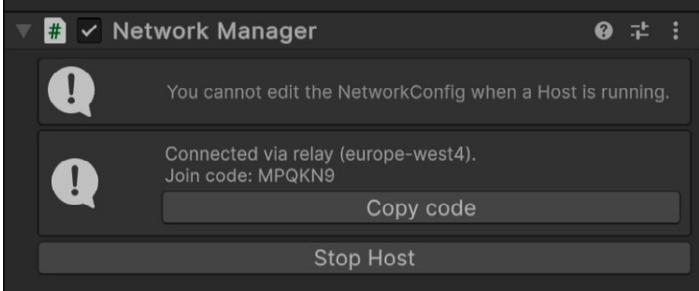

After connection, Relay provides a join code.

See this [Getting starting guide to Unity Relay](https://docs.unity.com/ugs/manual/relay/manual/get-started) for more information.

# <span id="page-79-0"></span>Multiplay Hosting

[Multiplay Hosting](https://docs.unity.com/ugs/en-us/manual/game-server-hosting/manual/welcome) removes the complexity of running and operating infrastructure at scale, so your development team can focus on creating engaging player experiences. It also provides ways for you to:

- Track server health and other [analytic data.](https://docs.unity.com/ugs/en-us/manual/game-server-hosting/manual/concepts/server-analytics)
- Update servers with [zero downtime patching](https://docs.unity.com/ugs/en-us/manual/game-server-hosting/manual/concepts/zero-downtime-releases).
- Place players in servers that offers the best experience based on [quality of service](https://docs.unity.com/ugs/en-us/manual/game-server-hosting/manual/concepts/query-protocols)  [\(QoS\) data](https://docs.unity.com/ugs/en-us/manual/game-server-hosting/manual/concepts/query-protocols).
- [Containerize your builds](https://docs.unity.com/ugs/en-us/manual/game-server-hosting/manual/concepts/container-builds) using Docker and the Multiplay Hosting container registry.

## Vivox

[Vivox](https://docs.unity.com/vivox/Article.html) enables better cooperative and competitive multiplayer experiences by letting your players talk through in-game voice or text chat. Vivox allows you to integrate text and voice chat into your service with a managed hosted solution. While also providing accessibility and regulatory features such as speech-to-text, chat filtering, and more.

Vivox allows player communication across multiple platforms, whether your game is built in Unreal, Unity, or a custom engine.

Plug into your game and configure your project settings to add communications to your project from the Unity Dashboard. Connect an unlimited number of users in 2D and 3D channels. Allow users to control voice volume, perform mute actions, and manage their channels.

See [this GDC session](https://unity.com/resources/megacity-metro?isGated=false) that explains how a number of multiplayer services were integrated into the Megacity Metro demo.

# <span id="page-80-0"></span>Sample projects and resources

Unity offers a variety of sample projects designed to help you get started with Netcode for GameObjects and Netcode for Entities. These resources provide practical examples to guide you through implementing multiplayer networking in your own applications.

# Resources for Netcode for GameObjects

### **Unity Learn: Get started with Netcode for GameObjects**

[This Unity Learn tutorial](https://learn.unity.com/tutorial/get-started-with-netcode-for-gameobjects#) provides practical steps on building and testing a basic multiplayer game in Unity, as well as utilizing and testing Remote Procedure Calls (RPCs) and Network Variables. You'll also learn how to create a simple user interface for different modes (Host, Client, and Server) and add and control basic movements in these modes.


A screenshot from the Unity Learn tutorial on Netcode GameObjects

<span id="page-82-0"></span>

### **Bitesize samples**

The [Bitesize Samples repository](https://github.com/Unity-Technologies/com.unity.multiplayer.samples.bitesize?tab=readme-ov-file) provides a series of sample code as modules to use in your games and better understand Netcode for GameObjects. The repository includes:

— [2D Space Shooter Sample](https://github.com/Unity-Technologies/com.unity.multiplayer.samples.bitesize/tree/main/Basic/2DSpaceShooter): Learn more about physics movement and status effects using Netcode NetworkVariables and object pooling.


The 2D Space Shooter from the Bitesize Samples

- [Distributed Authority Social Hub:](https://github.com/Unity-Technologies/com.unity.multiplayer.samples.bitesize/tree/main/Basic/DistributedAuthoritySocialHub) Learn how to set up this topology where control and management of the game state are distributed among multiple clients, reducing server load.
- [Multiplayer Use Cases Overview](https://github.com/Unity-Technologies/com.unity.multiplayer.samples.bitesize/tree/main/Basic/MultiplayerUseCases): This sample shows you how to perform common actions in a multiplayer environment, so that you can build the features of your game with them in mind.
- [Client Driven Sample:](https://github.com/Unity-Technologies/com.unity.multiplayer.samples.bitesize/tree/main/Basic/ClientDriven) Learn more about client-driven movements, networked physics, spawning vs statically placed objects, and object reparenting.
- [Dynamic Addressables Network Prefabs](https://github.com/Unity-Technologies/com.unity.multiplayer.samples.bitesize/tree/main/Basic/DynamicAddressablesNetworkPrefabs): Learn more about the dynamic prefab system, which allows us to add new spawnable prefabs at runtime.

<span id="page-83-0"></span>

#### **Boss Room**

[Boss Room](https://docs-multiplayer.unity3d.com/netcode/current/learn/bossroom/bossroom/) is a 3D casual co-op game sample project built with Netcode for GameObjects that is designed to help you explore the concepts and patterns behind a multiplayer game flow.

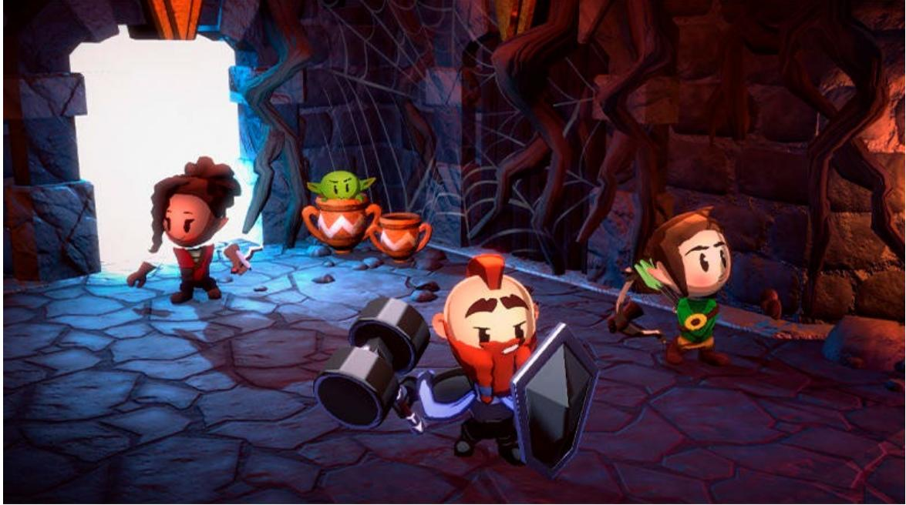

Boss Room is a slice of a full-featured co-op multiplayer game.

Both a functional game sample and learning tool for developers interested in networked multiplayer games, Boss Room is Unity's longest running production-ready multiplayer sample built with the Netcode for GameObjects workflows. This sample includes production-level code and is integrated with our Lobby and Relay hosting services.

Boss Room demonstrates game mechanics for network play, including character abilities and special attacks, networked physics, and state tracking (e.g., breakable objects, switches, and doors). These techniques demonstrate how to hide latency and create smooth gameplay even under less than ideal network conditions. Let's take a closer look.

**Game flow and state management:** Boss Room includes a practical implementation of game state, covering both the lobby and in-game play. It demonstrates how to handle player connections, load and unload scenes for network play, and manage graceful disconnections.

**Integration with UGS:** Boss Room integrates several UGS features, including Relay, Lobby, and Authentication.

**Utility scripts and tools:** The repo also contains a variety of utility scripts and tools that can be adapted for use in other projects, including examples of client authority, scene management utilities, and networked object pooling.

<span id="page-84-0"></span>**Client-server model:** Boss Room uses a client-server model where one of the players acts as the host (server) and other players are clients. Centralizing game logic reduces the chances of cheating and ensures that the game state is consistent across all clients.


The start menu in the Boss Room sample project

For a deep dive into the project, be sure to check out this [blog post](https://blog.unity.com/games/build-a-production-ready-multiplayer-game-with-netcode-for-gameobjects) and this four-part [YouTube](https://www.youtube.com/playlist?list=PLX2vGYjWbI0SbdD3ABTPKneNdG1Lm9v7N)  [webinar,](https://www.youtube.com/playlist?list=PLX2vGYjWbI0SbdD3ABTPKneNdG1Lm9v7N) "Build a production-ready multiplayer game with Netcode for GameObjects."

The series covers foundational game mechanics and server authority, including how to implement networked gameplay and object spawning. It also demonstrates how to enhance game resilience to player actions and optimize for better bandwidth management. This resource is for developers looking for practical, hands-on guidance using a full-featured multiplayer project.

#### **Small Scale Competitive Multiplayer template**

Available from the Unity Hub, this template provides a starting point to create and ship your multiplayer project using [Netcode For GameObjects](https://github.com/Unity-Technologies/com.unity.netcode.gameobjects) and [UGS](https://unity.com/solutions/gaming-services).

The template includes a Bootstrapper tool that helps you test using various network modes (Host, Client, Server) and dynamic configurations.


To get started open the project and follow the instructions in the included welcome dialog. Follow the in-editor tutorials or explore on your own and load the start scene from the **Multiplayer > Bootstrapper** menu item. Adjust the value of each field of the Bootstrapper according to what you want to test and enter Play mode.

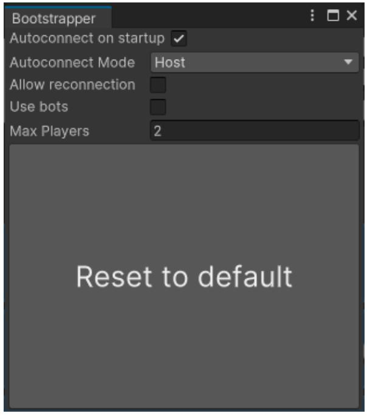

Set the Bootstrapper options.

Remember that you can access tutorials and useful resources at any time from the **Tutorials > Show tutorials** menu.

<span id="page-86-0"></span>

### **VR Multiplayer template**

| 000                        | New Project                           |                                                                                                                                                              |
|----------------------------|---------------------------------------|--------------------------------------------------------------------------------------------------------------------------------------------------------------|
|                            | Editor Version: Unity 2023.X.XX LTs ◇ |                                                                                                                                                              |
| Q<br>Search                | VR Multiplayer                        |                                                                                                                                                              |
| =<br>All Templates         | Template                              |                                                                                                                                                              |
| 0<br>Core<br>. I<br>Sample | 2D Mobile<br>Template                 |                                                                                                                                                              |
| S Learning                 | 3D<br>0<br>Template                   | VR Multiplayer<br>Quickstart your Virtual Reality (VR)<br>Multiplayer applications with a sample scene,<br>assets, and the recommended packages<br>Read more |
|                            | 20<br>0<br>Template                   |                                                                                                                                                              |
|                            | Universal<br>SRP<br>Template          | PROJECT SETTINGS<br>Project Name                                                                                                                             |
|                            | High Definition<br>SRP<br>Template    | My Project<br>Location<br>/Unity/My Project                                                                                                                  |
|                            | AR<br>30<br>Template                  | Unity Cloud Organization<br>V<br>Organization-Name                                                                                                           |
|                            | VR<br>Template                        | Connect to Unity Cloud @ HEW<br>Use Unity Version Control 17 HEW                                                                                             |
|                            |                                       | Create Project<br>Cancel                                                                                                                                     |

Open the VR Multiplayer template from the Unity Hub.

The [VR Multiplayer template](https://discussions.unity.com/t/new-vr-multiplayer-template-available/1488824) is is designed for creators starting a new project that will target an OpenXR device. It provides everything you need for networked interactions, voice chat, lobbies, and more. It leverages Unity Gaming Services, Netcode For GameObjects and the XR Interaction Toolkit and is built to work well on the Meta Quest platform as well as other OpenXR compliant devices. The key features of the VR Multiplayer template include:

- Networked Interactions via XRI Interaction Toolkit and Netcode for GameObjects
- Voice Communication via Vivox
- Connect to anyone, anywhere with Relay and Lobby
- Networked Avatars and Hands
- Works cross platform via OpenXR

Download the Unity VR Multiplayer Template for Unity 2022 LTS and Unity 6 Preview from the Unity Hub and check out the [quickstart guide](https://docs.unity3d.com/Packages/com.unity.template.vr-multiplayer@2.0/manual/index.html).

<span id="page-87-0"></span>

# Resources for Netcode for Entities

#### **Getting started with Netcode for Entities**

This [on-demand webinar](https://unity.com/resources/getting-started-with-netcode-for-entities?isGated=false) takes a deep dive into Megacity Metro, Unity's large-scale, crossplatform multiplayer game sample made with Netcode for Entities and Unity Gaming Services. The webinar is for users who are already familiar with DOTS and want to start creating ambitious multiplayer games.

#### **ECS Netcode samples**

[These samples](https://github.com/Unity-Technologies/EntityComponentSystemSamples) demonstrate many basic and advanced features, including syncing, connection flows, integration with Unity Physics, and more. Start with the [Networked Cube tutorial,](https://docs.unity3d.com/Packages/com.unity.netcode@1.2/manual/networked-cube.html) which covers:

- Establishing a connection with the server.
- Communicating with the server.
- Spawning synchronized entities on the server.
- Creating standalone builds of the server and client.
- Running the server and a client in Play mode within the Editor.


The Networked Cube tutorial running in the Editor and as a standalone build

<span id="page-88-0"></span>

#### **ECS Network Racing**

This [multiplayer racing game sample](https://github.com/Unity-Technologies/ECS-Network-Racing-Sample) showcases best practices for using Unity Netcode for Entities. This demo features an implementation of client-server architecture with client-side prediction, interpolation, and lag compensation.


ECS Racing showcases advanced multiplayer features.

#### **Megacity Metro**

[Megacity Metro](https://unity.com/demos/megacity-competitive-action-sample) (Unity 6, Unity 2022 LTS) is a scalable, high-concurrency, cross-platform demo of our latest technology, including the Netcode for Entities package. This third-person multiplayer action demo supports 128+ players.

The multiplayer sample is perfect for those who want to master implementing serverauthoritative gameplay and leveraging UGS for an end-to-end multiplayer game.


The Megacity Metro demo from Unity supports 128+ players.

<span id="page-89-0"></span>

Learn more about building ambitious games using ECS for Unity and our Multiplayer solutions. ECS for Unity brings value to seasoned Unity creators who need additional control and determinism to achieve more ambitious games.

Megacity Metro features advanced mechanics like interpolation, client-side prediction and lag compensation. Download the demo to explore services like Multiplay Hosting, Matchmaker, and Vivox Voice Chat.

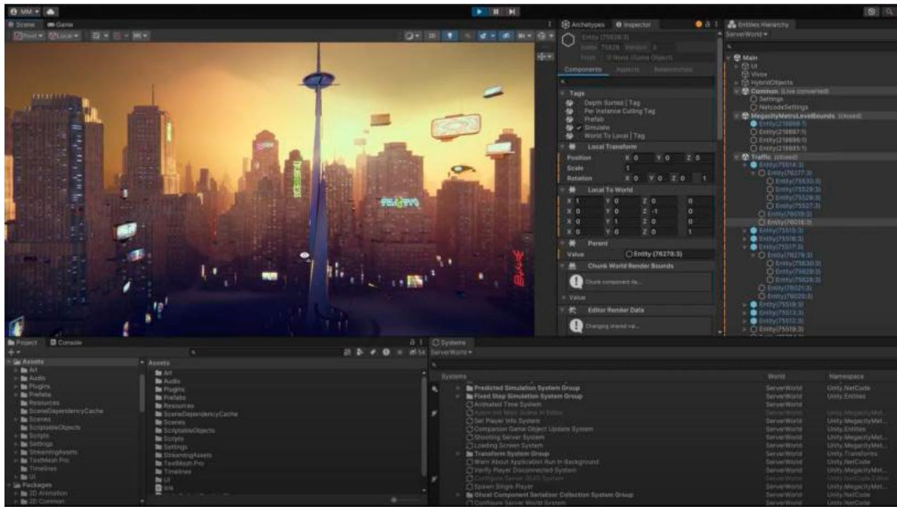

Megacity Metro uses Netcode for Entities in a multiplayer action demo.

## Experimental Multiplayer Services package

Building a multiplayer game requires integrating several products and services together. With the new **Multiplayer Services** package (**com.unity.services.multiplayer**), we're simplifying integration and dependencies management across multiplayer services while offering a new way to interact with the products.

The Multiplayer Services package is a one-stop solution for adding online multiplayer elements to a game. Powered by UGS, it combines capabilities from services such as Relay and Lobby into a single new "Sessions" system to help you quickly define how groups of players connect together.

The Multiplayer Services package enables you to create peer-to-peer (P2P) sessions while providing multiple methods for players to join those sessions, such as by a join code, by browsing a list of active sessions, and "Quick Join."

# <span id="page-90-0"></span>Next steps

Now that you have a solid foundation in networking concepts and practical experience with Netcode for GameObjects, continue your multiplayer learning journey:

**Dive into Unity Learn:** We're simplifying the multiplayer learning curve even further with new guided content. On Unity Learn, our first [Multiplayer Course](https://learn.unity.com/tutorial/get-started-with-netcode-for-gameobjects#) will teach you the basics of Netcode for GameObjects and guide you through your first networked project.

**Explore the sample projects:** Dive deeper into the sample projects, such as Boss Room, Galactic Kittens, and the Bitesize Samples. Modding these projects will expose you to new techniques and help discover the best practices when working with networked multiplayer.

**Experiment with multiplayer services:** Remember there's no need to reinvent the wheel. Relay, Lobby, and Matchmaker are ready to deploy into your projects. These services can significantly reduce development time.

**Master advanced techniques:** As your project's needs grow, consider Netcode for Entities. This advanced package includes techniques like client-side prediction and lag compensation for the highest networking performance. The Megacity Metro and ECS Racing samples showcase these features in action.

Happy networking.


[unity.com](https://unity.com)